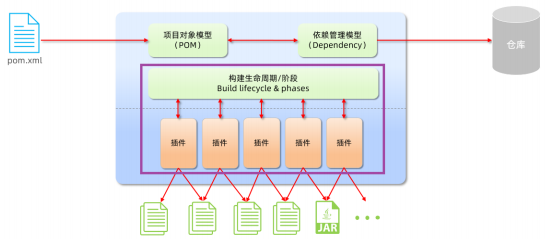
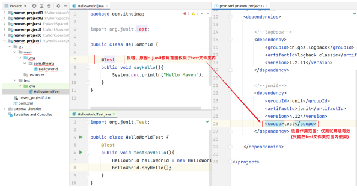
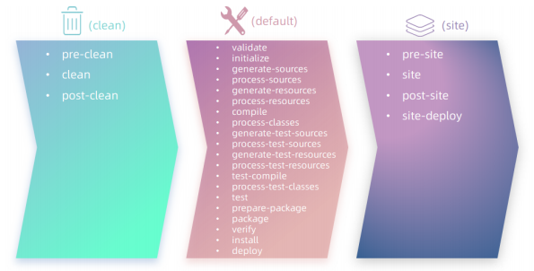

# [maven](https://maven.apache.org/)

## 一、概述

### 1.1 maven简介

Maven是apache旗下的一个开源项目，是一款用于管理和构建java项目的工具。

### 1.2 maven作用

- 依赖管理

  方便快捷的管理项目依赖的资源（jar包），避免版本冲突问题

- 统一项目结构

  提供标准、统一的项目结构

- 项目构建

  标准跨平台（Linux、windows、MacOS）的自动化项目构建方式

### 1.3 maven模型



### 1.4 maven安装

重要目录简介：

bin目录：存放的是可执行文件。（mvn命令重点关注）

conf目录：存放maven的配置文件。（settings.xml配置文件后期需要修改）

lib目录：存放maven依赖的jar包

1. 下载及安装

   [下载链接](https://maven.apache.org/download.cgi)

2. 配置本地仓库

   新建mvn_rego文件夹用于存放jar包，复制其地址（绝对），修改conf/settings.xml中的`<localRepository>`标签（第53行）为一个指定目录

   ```xml
   <localRepository>E:\software\maven\apache-maven-3.9.9</localRepository>
   ```

3. 配置阿里云私服

   修改conf/settings.xml中的`<mirrors>`标签（第147行），为其添加如下子标签

   ```xml
   <mirror>
   	<id>alimaven</id>
   	<name>aliyun maven</name>
   	<url>http://maven.aliyun.com/nexus/content/groups/public/</url>
   	<mirrorOf>central</mirrorOf>
   </mirror>
   ```

4. 配置环境变量

   在系统变量处新建一个变量MAVEN_HOME，变量为maven的解压安装目录

   PATH环境变量的值，设置为：%MAVEN_HOME%\bin

   打开DOS命令提示符进行验证 mvn -v

### 1.5 在idea中集成

- 在当前工程配置maven环境

  选择 IDEA中 File => Settings => Build,Execution,Deployment => BuildTools => Maven，配置工程的编译版本为11

- 全局设置

  进入到IDEA欢迎页面，选择 IDEA中 File => close project，打开 All settings , 选择 Build,Execution,Deployment => Build Tools => Maven，配置工程的编译版本为11

## 二、详解

### 2.1 maven坐标

Maven中的坐标是 资源的唯一标识 , 通过该坐标可以唯一定位资源位置

Maven坐标主要组成

- groupId：定义当前Maven项目隶属组织名称（通常是域名反写，例如：com.itheima）
- artifactId：定义当前Maven项目名称（通常是模块名称，例如 order-service、goodsservice）
- version：定义当前项目版本号

## 三、依赖管理

### 3.1 依赖配置

依赖：指当前项目运行所需要的jar包。一个项目中可以引入多个依赖

例如：在当前工程中，我们需要用到logback来记录日志，此时就可以在maven工程的pom.xml文件中，引入logback的依赖。具体步骤如下：

1. 在pom.xml中编写标签

2. 在标签中使用引入坐标

3. 定义坐标的 groupId、artifactId、version

4. 点击刷新按钮，引入最新加入的坐标

   ```xml
   <dependencies>
   <!-- 第1个依赖 : logback -->
   	<dependency>
   		<groupId>ch.qos.logback</groupId>
   		<artifactId>logback-classic</artifactId>
   		<version>1.2.11</version>
   	</dependency>
   </dependencies>
   ```

   如果不知道依赖的坐标信息，可以到mvn[的中央仓库中搜索](https://mvnrepository.com/)

### 3.2 依赖传递

直接依赖：在当前项目中通过依赖配置建立的依赖关系

间接依赖：被依赖的资源如果依赖其他资源，当前项目间接依赖其他资源

排除依赖：指主动断开依赖的资源。（被排除的资源无需指定版本）

```xml
<dependency>
	<groupId>com.itheima</groupId>
	<artifactId>maven-projectB</artifactId>
	<version>1.0-SNAPSHOT</version>
	<!--排除依赖, 主动断开依赖的资源-->
	<exclusions>
 		<exclusion>
			<groupId>junit</groupId>
			<artifactId>junit</artifactId>
		</exclusion>
	</exclusions>
</dependency>
```

### 3.3 依赖范围

在项目中导入依赖的jar包后，默认情况下，可以在任何地方使用

作用范围：

- 主程序范围有效（main文件夹范围内）

- 测试程序范围有效（test文件夹范围内）
- 是否参与打包运行（package指令范围内）



如上图所示，给junit依赖通过scope标签指定依赖的作用范围。 那么这个依赖就只能作用在测试环境，其他环境下不能使用。

scope标签的取值范围:

|     scope值     | 主程序 | 测试程序 | 打包（运行） |    范例     |
| :-------------: | :----: | :------: | :----------: | :---------: |
| compile（默认） |   Y    |    Y     |      Y       |    log4j    |
|      test       |        |    Y     |      -       |    junit    |
|    provided     |   Y    |    Y     |      -       | servlet-api |
|     runtime     |   -    |    Y     |      Y       |   jdbc驱    |

### 3.4 生命周期

Maven的生命周期就是为了对所有的构建过程进行抽象和统一

Maven对项目构建的生命周期划分为3套（相互独立）：

1. clean：清理工作。
2. default：核心工作。如：编译、测试、打包、安装、部署等。
3. site：生成报告、发布站点等。

三套生命周期又包含具体的阶段



主要关注以下几个：

- clean：移除上一次构建生成的文件
- compile：编译项目源代码
- test：使用合适的单元测试框架运行测试(junit)
- package：将编译后的文件打包，如：jar、war等
- install：安装项目到本地仓库