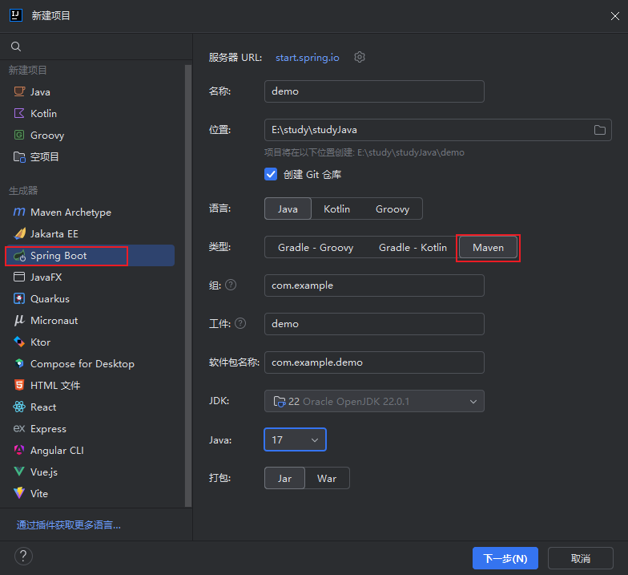
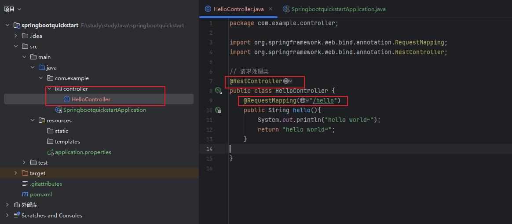
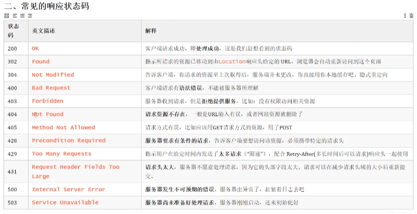

# SpringBootWeb

[spring](https://spring.io/)发展到今天已经形成了一种开发生态圈，Spring提供了若干个子项目，每个项目用于完成特定的功能。而我们在项目开发时，一般会偏向于选择这一套spring家族的技术，来解决对应领域的问题，那我们称这一套技术为spring全家桶。Spring家族旗下这么多的技术，最基础、最核心的是 SpringFramework，其他的spring家族的技术，都是基于SpringFramework的。

通过springboot可以快速的帮我们构建应用程序

## 一、快速入门

**需求**：基于SpringBoot的方式开发一个web应用，浏览器发起请求/hello后，给浏览器返回字符串“Hello World ~”

**开发步骤**

1. 创建SpringBoot工程项目

   

2. 定义HelloController类，添加方法hello，并添加注解

   

3. 测试运行

​	浏览器输入`http://localhost:8080/hello`

## 二、HTTP协议

### 2.1 概述

HTTP：Hyper Text Transfer Protocol(超文本传输协议)，规定了浏览器与服务器之间数据传输的规则。

特点：

- 基于TCP协议
- 基于请求-响应模型
- HTTP协议是无状态协议

### 2.2 请求协议

请求协议：浏览器将数据以请求格式发送到服务器包括：**请求行**、**请求头** 、**请求体**

**请求行**

请求方式 资源路径 版本

**常用请求头**

| 参数            |                             示意                             |
| :-------------- | :----------------------------------------------------------: |
| Host            |                       表示请求的主机名                       |
| User-Agent      |                          浏览器版本                          |
| Accept          | 表示浏览器能接收的资源类型，如text/*，image/*或者*/*表示所有 |
| Accept-Language |    表示浏览器偏好的语言，服务器可以据此返回不同语言的网页    |
| Accept-Encoding |      表示浏览器可以支持的压缩类型，例如gzip, deflate等       |
| Content-Type    |                      请求主体的数据类型                      |
| Content-Length  |                 数据主体的大小（单位：字节）                 |
| **请求体**      |                                                              |

存放请求参数

### 2.3 响应协议

响应的数据也分为3部分：**响应行**、**响应头** 、**响应体**

**响应行**：响应数据的第一行。响应行由 协议及版本 、 响应状态码 、 状态码描述 组成

常见状态码

| 状态码 |                             描述                             |
| ------ | :----------------------------------------------------------: |
| 1XX    | **响应中** --- 临时状态码。表示请求已经接受，告诉客户端应该继续请求或者如果已经完成则忽略 |
| 2XX    |       **成功** --- 表示请求已经被成功接收，处理已完成        |
| 3XX    | **重定向** --- 重定向到其它地方，让客户端再发起一个请求以完成整个处理 |
| 4XX    | **客户端错误** --- 处理发生错误，责任在客户端，如：客户端的请求一个不存在的资源，客户端未被授权，禁止访问等 |
| 5XX    | **服务器端错误** --- 处理发生错误，责任在服务端，如：服务端抛出异常，路由出错，HTTP版本不支持等 |

**响应头**：响应数据的第二行开始。格式为key：value形式

常见响应头

| key              |                            示意                            |
| ---------------- | :--------------------------------------------------------: |
| Content-Type     |      表示该响应内容的类型，例如text/html，image/jpeg       |
| Content-Length   |               表示该响应内容的长度（字节数）               |
| Content-Encoding |                表示该响应压缩算法，例如gzip                |
| Cache-Control    | 指示客户端应如何缓存，例如max-age=300表示可以最多缓存300秒 |
| Set-Cookie       |           告诉浏览器为当前页面所在的域设置cookie           |

**响应体**： 响应数据的最后一部分。存储响应的数据

### 2.4 协议解析

## 三、请求响应

### 3.1 请求

简单参数

### 3.2 响应

### 3.3 分层解耦