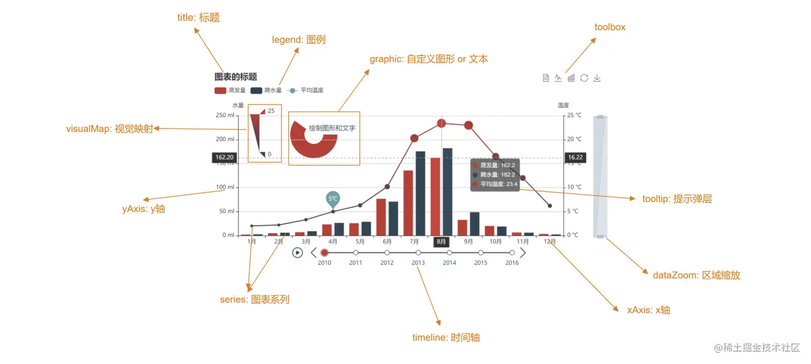

# ECharts

## 一、初识

简介：一个基于 JavaScript 的开源可视化图表库。

官方网站：[ECharts](https://echarts.apache.org/zh/index.html)

社区网站：[isqqw](https://www.isqqw.com/?t=pie) [makeapie](https://www.makeapie.cn/echarts)

vscode 插件：[echarts-enhanced-completion](https://github.com/ren-wei/echarts-enhanced-completion/blob/master/README_zh-cn.md)

快速了解功能名称，帮助定位到配置项手册：[术语速查手册](https://echarts.apache.org/zh/cheat-sheet.html)

地图数据：[datav](https://datav.aliyun.com/portal/school/atlas/area_selector#&lat=30.332329214580188&lng=106.72278672066881&zoom=3.5)

## 二、起步

1. 获取 echarts 并在 项目中导入

   ```sh
   npm install echarts
   ```

   ```js
   import * as echarts from "echarts";
   ```

2. 准备一个具备大小的 DOM 容器

   ```html
   <div id="main" style="width: 600px;height:400px;"></div>
   ```

3. 初始化 echarts 实例对象

   ```js
   var myChart = echarts.init(document.getElementById("main"));
   ```

4. 指定配置项和数据(option)

   ```js
   var option = {
     // ......
   };
   ```

5. 将配置项设置给 echarts 实例对象

   ```js
   myChart.setOption(option);
   ```

6. 监听图表容器的大小并改变图表大小

   ```js
   window.addEventListener('resize', function() {
      myChart.resize();
    });
   ```

7. 销毁实例（用于组件卸载时）

   ```js
   myChart.dispose()
   ```

## 三、基础配置项



详见：[术语速查手册](https://echarts.apache.org/zh/cheat-sheet.html)

1. `color`：调色盘颜色列表；可设置线条的颜色
2. `title`：图表的标题
3. `tooltip`：提示框组件
4. `legend`：图例组件；series 里面有了 name 值则 legend 里面的 data 可以删掉
5. `toolbox`：工具箱组件；可以另存为图片等功能
6. `grid`：网格配置； grid 可以控制线形图 柱状图 图表大小
7. `xAxis`：设置 x 轴的相关配置
8. `yAxis`：设置 y 轴的相关配置
9. `series`：系列图表配置；它决定着显示哪种类型的图表

## 四、常用业务逻辑

### 1、轮播效果

需求设计：以地图实例，提示框组件轮播，区域高亮，鼠标移入或移除停止轮播

实现思路：

```js
function swiper(myChart, option) {
      let index = 0;
      let mTime = null;
      const action = (type, seriesIndex, dataIndex) =>
        myChart.dispatchAction({ type, seriesIndex, dataIndex });
      // 轮播实现
      const run = () => {
        mTime = setInterval(() => {
          // 清除之前的高亮
          action("downplay", 0, null);
          index++;
          // 提示框组件显示
          action("showTip", 0, index);
          // 当前下标高亮
          action("highlight", 0, index);
          // 循环
          if (index >= option.series[0].data.length - 1) {
            index = -1;
          }
        }, 2000);
      };
      run();
      // 鼠标移入
      myChart.on("mouseover", (params) => {
        // 停止轮播
        clearInterval(mTime);
        mTime = null;
        // 清除之前的高亮
        action("downplay", 0, null);
        // 提示框组件显示
        action("showTip", 0, params.dataIndex + 1);
        // 当前下标高亮
        action("highlight", 0, params.dataIndex);
      });
      // 鼠标移出
      myChart.on("mouseout", () => {
        if (mTime) {
          clearInterval(mTime);
        }
        run();
      });
    }
```

### 2、地图下钻


