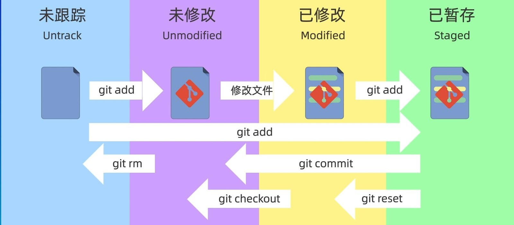
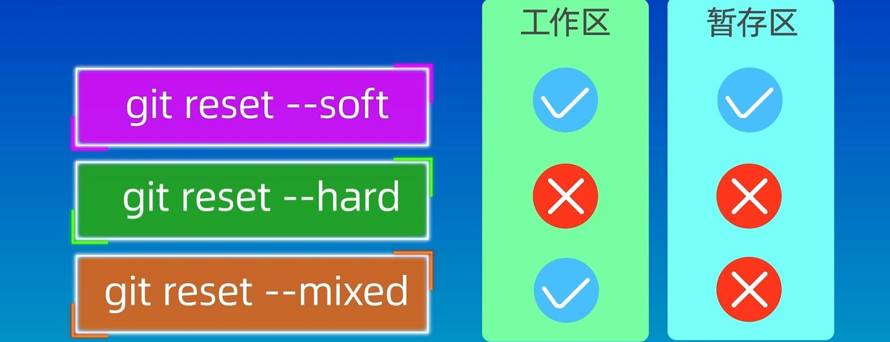

# Git

## 一、初始化配置

1、查看git版本

```shell
git -v
```

2、配置个人的用户名称和电子邮件地址

```shell
git config --global user.name 用户名称
git config --global user.email 电子邮件地址
```

3、查看配置信息

```shell
git config --global --list
```

## 二、工作区、暂存区和本地仓库

- **工作区：**就是你在电脑里能看到的目录。
- **暂存区：**用于临时存放即将提交的修改内容，一般存放在 .git目录下的 index 文件（.git/index）中。
- **本地仓库：**工作区有一个隐藏目录 .git。



## 三、基本操作

### 3.1 创建仓库

- 初始化仓库

  ```shell
  git init
  ```

- 克隆仓库

  ```shell
  git clone
  ```

### 3.2  提交

- 添加文件到暂存区

  ```shell
  git add 文件名或 .
  ```

- 查看仓库当前的状态

  ```shell
  git status
  ```

- 提交暂存区到本地仓库

  ```shell
  git commit -m [message]
  ```

### 3.3 查看日志

- 查看历史提交记录

  ```shell
  git log
  git log --oneline
  ```

### 3.4 版本回退

```shell
git reset [--soft | --mixed | --hard] [HEAD]
```



**--soft** 参数，工作区和暂存区不会被清空

```shell
git reset --soft HEAD~1 # 回退上一个版本
```

**--hard** 参数撤销工作区中所有未提交的修改内容，将暂存区与工作区都回到上一次版本，并删除之前的所有信息提交，谨慎使用 **–-hard** 参数，它会删除回退点之前的所有信息

```shell
git reset --hard HEAD~3  # 回退上上上一个版本  
git reset –hard bae128  # 回退到某个版本回退点之前的所有信息。 
git reset --hard origin/master    # 将本地的状态回退到和远程的一样
```

**--mixed** 为默认，可以不用带该参数，用于重置暂存区的文件与上一次的提交(commit)保持一致，工作区文件内容保持不变

```shell
git reset HEAD^            # 回退所有内容到上一个版本 
git  reset  052e           # 回退到指定版本
```

### 3.5 远程操作

- **[git remote](https://www.runoob.com/git/git-remote.html)**：提供了一些用于查看、添加、重命名和删除远程仓库的功能

  ```shell
  # 列出当前仓库中已配置的远程仓库
  git remote
  # 列出当前仓库中已配置的远程仓库，并显示它们的 URL
  git remote -v
  # 添加一个新的远程仓库 origin为远程地址的别名
  git remote add origin https://github.com/user/repo.git
  # 将已配置的远程仓库重命名
  git remote rename origin new-origin
  # 从当前仓库中删除指定的远程仓库
  git remote remove new-origin
  # 修改指定远程仓库的 URL
  git remote set-url origin https://github.com/user/new-repo.git
  # 显示指定远程仓库的详细信息，包括 URL 和跟踪分支
  git remote show origin
  ```

- **[git fetch](https://www.runoob.com/git/git-fetch.html)**：从远程获取代码库

- **[git pull](https://www.runoob.com/git/git-pull.html)**：下载远程代码并合并，**git pull** 其实就是 **git fetch** 和 **git merge FETCH_HEAD** 的简写。

  ```shell
  git pull <远程主机名> <远程分支名>:<本地分支名>
  # 将远程主机 origin 的 master 分支拉取过来，与本地的 brantest 分支合并
  git pull origin master:brantest
  ```

- **[git push](https://www.runoob.com/git/git-push.html)**：将本地的分支版本上传到远程并合并

  ```shell
  git push <远程主机名> <本地分支名>:<远程分支名>
  # 将本地的 master 分支推送到 origin 主机的 master 分支
  git push origin master
  git push origin master:master
  ```

## 四、分支管理

使用分支意味着你可以从开发主线上分离开来，然后在不影响主线的同时继续工作。

```shell
# 创建分支
git branch (branchname)
# 切换分支
git checkout (branchname)
# 合并分支
git merge 
# 列出分支
git branch
# 删除分支
git branch -d (branchname)
```

