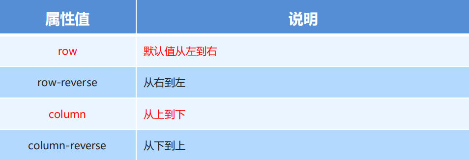
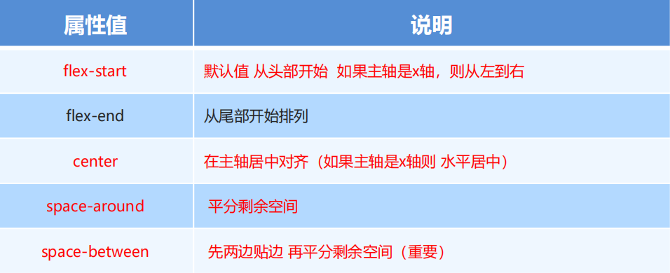
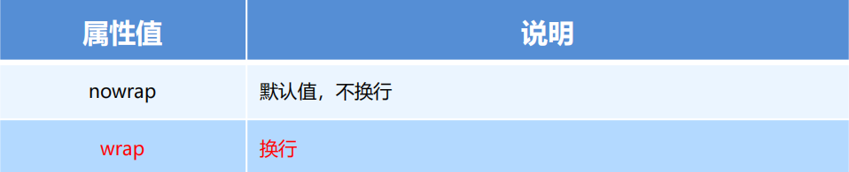
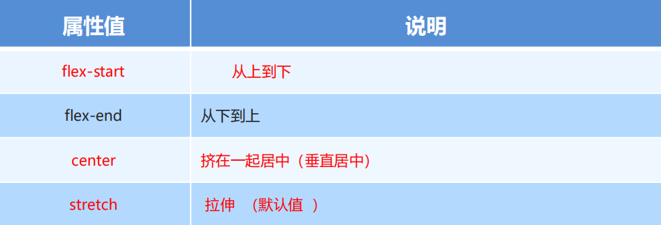
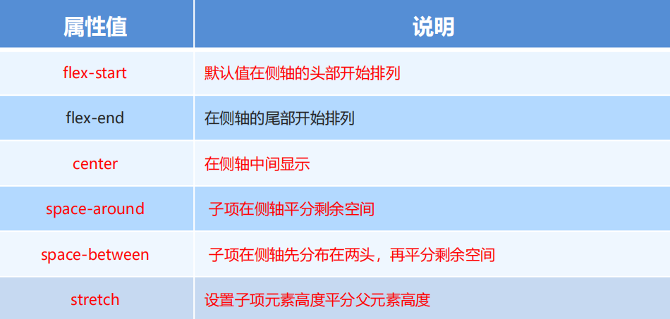
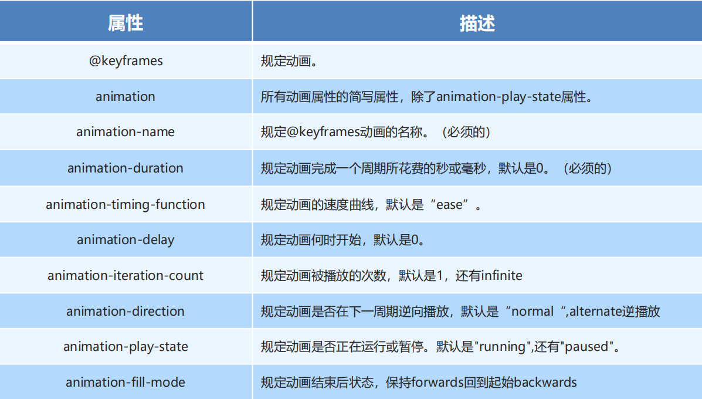
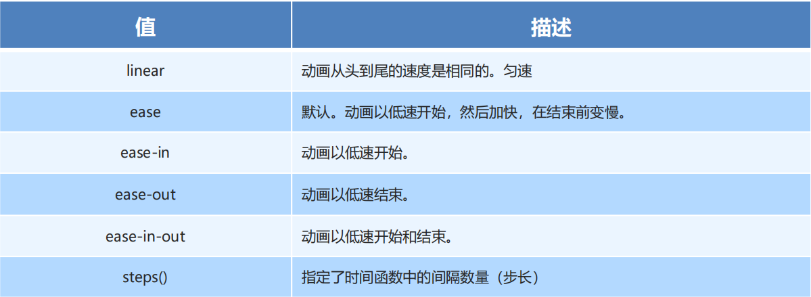
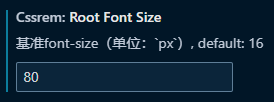

# CSS

## 一、css特性

- 继承性

  概念：子级默认继承父级的文字控制属性。

  注意：如果标签有默认文字样式会继承失败。 例如：a 标签的颜色、标题的字体大小。

- 层叠性

  概念：相同的属性会覆盖：后面的 CSS 属性覆盖前面的 CSS 属性；不同的属性会叠加：不同的 CSS 属性都生效。

  注意：选择器类型相同则遵循层叠性，否则按选择器优先级判断。

- 优先级

  基础选择器： !important>行内样式> id选择器 >类选择器 >标签选择器 >通配符选择器

  复合选择器：公式：（行内样式，id选择器个数，类选择器个数，标签选择器个数）；从左向右依次比较选个数，同一级个数多的优先级高，如果个数相同，则向后比较，!important 权重最高，继承权重最低。

## 二、单位

- px，像素单位

- em， 相对单位，相对于父级元素的font-size值

- rem，概念：rem单位是相对于HTML标签的字号计算结果,1rem = 1HTML字号大小，rem单位的尺寸 = px单位数值 / 基准根字号

- vw/vh：

  vw：viewport width（1vw = 1%视口宽度 ），vw单位的尺寸 = px 单位数值 / ( 1/100 视口宽度 )

  vh：viewport height ( 1vh = 1%视口高度 )，vh是1/100视口高度，全面屏视口高度尺寸大，如果混用可能会导致盒子变形

## 三、基本选择器

- id选择器，`#id{color:#F7FBFC;}`添加id属性: `<p id="id"></p>` id名不允许重复
- 标签选择器，`h1{color:#769FCD;}`
- 类选择器，`.p1{ color:#B9D7EA;} ` 添加class属性:`<p class="p1"></p> `类名允许重复
- 通配符选择器*，无需调用，所有标签相同样式
- 选择器优先级：!important>行内样式>id选择器 > class选择器=伪类选择器 > 标签选择器=伪元素选择器>*通用选择器

## 四、复杂选择器

- 后代选择器：选择器语法：父选择器 子选择器 { CSS 属性}， 父子选择器之间用空格隔开。

- 并集选择器：选择器写法：选择器1, 选择器2, …, 选择器N { CSS 属性}，  选择器之间用 , 隔开。

- 交集选择器：选择器写法：选择器1选择器2 { CSS 属性}， 选择器之间连写，没有任何符号。

  注意：如果交集选择器中有标签选择器，标签选择器必须书写在最前面。

  ```html
  <style>
  p.box {
  color: red;
  }
  </style>
  <p class="box">p 标签，使用了类选择器 box</p>
  <p>p 标签</p>
  <div class="box">div 标签，使用了类选择器 box</div>
  ```

- 子代选择器：选择器写法：父选择器 > 子选择器 { CSS 属性}， 父子选择器之间用 > 隔开。

- 兄弟选择器：

  选择器 + 选择器{CSS 属性} 选择紧挨着的下一个元素

  选择器 ~ 选择器{CSS 属性} 选择所有元素

  注意：需要选择紧接在另一个元素后的元素，而且二者有相同的父元素。

  ```html
  <style>
  div p+span{color:red;}
  div p~span{color:red;}
  </style>
  
  <div>
  	 <p>我是一个段落</p>
  	 <span>我是一个span</span>
  	 <span>我是一个span</span>
  	 <span>我是一个span</span>
  </div>
  ```

- 属性选择器（css3)：元素  [属性1] [属性2] {CSS 属性}；根据元素属性来选择元素，空格隔开

  ```html
  //css
  <style>
  .demo1[title]{color:red;}
  .demo1[title=我是一段提示]{color:red;} //完全相等
  .demo1[title^=我是]{color:red;} //根据这段字符开头
  .demo1[title~=我是]{color:red;} //包含某个单词
  .demo1[title$=我是]{color:red;} //以指定值结尾
  .demo1[title*=我是]{color:red;} //包含某个词有位置不重要
  </style>
  
  //html
  <p class=”demo1” title=”我是一段提示”>我是一个段落</p>
  ```

- 链接伪类选择器：执行顺序LVHA

  ```css
  a:link{ /* 选择所有未被访问的链接 */ }
  a:visited{ /* 选择所有已访问的链接 */ }
  a:hover{ /* 鼠标指针位于其上的链接 */ }
  a:active{ /* 鼠标按下未弹起的链接 */ }
  ```

- :focus 伪类选择器：用于选取获得焦点的表单元素

  ```css
  input:focus {
        background-color: yellow;
      }
  ```

- 结构伪类选择器（css3）1

  `E:first-child`：查找父元素中的第一个子元素E

  `E:last-child`：查找父元素中的最后一个子元素E

  `E:nth-child（N）`：查找查找父元素中的第N个子元素E

  - 偶数标签`nth-child（even）`
  - 奇数标签`nth-child（odd ）`
  - 找到5的倍数标签`nth-child（5n）`
  - 找到5以后的标签`nth-child（n+5）`
  - 找到5以前的标签`nth-child（-n+5）`
  - 公式中的n取值从 0 开始

- 结构伪类选择器（css3）2

  `E:first-of-type`： 指定类型E的第一个

  `E:last-of-type`  ： 指定类型E的最后一个

  `E:nth-of-type(n)` ：指定类型E的最n个

区别：nth-child 对父元素里面所有孩子排序选择（序号是固定的） 先找到第n个孩子，然后看看是否和E匹配，nth-of-type 对父元素里面指定子元素进行排序选择。 先去匹配E ，然后再根据E 找第n个孩子

- 伪元素选择器（css3）

  `E::before{}`在E元素前面添加一个伪元素

  `E::after{}`在E元素后面添加一个伪元素

  必须设置 content: ””属性，用来 设置伪元素的内容，如果没有内容，则引号留空即可

  伪元素默认是行内显示模式

## 五、字体文本属性

- 字体属性：用于定义字体系列、大小、粗细、和文字样式

```css
/* 1、字体系列 */
font-family: Arial,"Microsoft Yahei", "微软雅黑";
/* 2、字体大小;谷歌浏览器默认的文字大小为16px */
font-size: 20px;
/* 3、字体粗细;normal/400:正常;bold/700:加粗;bolder:特粗体;lighter:细体 */
font-weight: bold;
/* 4、文字样式;normal正常/italic斜体 */
font-style:normal;
/* 5、复合属性;font：是否倾斜 是否加粗 字号/行高 字体（空格隔开注意顺序） */
font: normal 400 12px/2 宋体；
```

- 文本属性：定义文本的外观，比如文本的颜色、对齐文本、装饰文本、文本缩进、行间距等。

```css
/* 1、文本颜色;关键字：red/十六进制：#ff0000/rgba(r,g,b,a) */
color: red;
/* 2、对齐文本(水平);left(默认)/right/center 可用于行内，行内块元素*/
text-align: center;
/* 3、装饰文本;none无/underline下划线/line-through删除线/overline上划线 */
text-decoration: underline;
/* 4、文本缩进;数字+px/数字+em */
text-indent: 2em;
/* 5、行高;数字+px/数字：字体大小的倍数 */
line-height: 25px;
/* 6、文本阴影;text-shadow:阴影水平偏移量 阴影垂直偏移量 阴影模糊的距离(可选) 阴影颜色（可选）; */
text-shadow: 1px 1px 0 rgba(255, 255, 255, 1), 1px 1px 2px rgba(0, 85, 0, .8);
```

- 添加自定义字体

  ```css
  /* 字体声明 */
  @font-face {
    font-family: "Microsoft Yahei";
    src: url('./Microsoft Yahei.ttF');
  }
  .font {
    font-family: Microsoft Yahei;
    font-size: 32px;
    font-weight: 400;
  }
  ```

## 六、背景属性

```css
/* 1、背景色;半透明：rgba(0, 0, 0, 0.3) */
background-color: transparent;
/* 2、背景图;路径不要加引号 */
background-image: url();
/* 3、背景平铺;repeat-x | repeat-y | no-repeat */
background-repeat: no-repeat;
/* 4、背景图片位置;方位名词：left | center | right | top | bottom  或者 精确单位 (x轴，y轴)*/
background-position: center;
/* 5、背景附着; scroll 背景图像随对象内容滚动| fixed 背景图像固定*/
background-attachment: fixed;
/* 6、背景图像大小;auto 真实大小| cover 覆盖,超出容器 | contain 宽或高相等，被包含在容器内*/
background-size: contain;
/* 7、复合写法;背景色 背景图 背景图平铺方式 背景图位置/背景图缩放 背景图固定 （空格隔开各个属性值，不区分顺序） */
background: pink url(./images/1.png) no-repeat right center/cover fixed;
```

## 七、元素显示模式

### 1、元素分类

- 块元素：独占一行，高度，宽度、外边距以及内边距都可以控制，宽度默认是容器（父级宽度）的100%。

  如：`<h1>~<h6>、<p>、<div>、<ul>、<ol>、<li>`

  注意：`<h1>~<h6>、<p>` 标签是文字类块级标签，不能放块级元素

- 行内元素：相邻行内元素在一行上，一行可以显示多个；高、宽直接设置是无效的；默认宽度就是它本身内容的宽度；行内元素只能容纳文本或其他行内元素。

  如：`<a>、<strong>、<b>、<em>、<i>、<del>、<s>、<ins>、<u>、<span>`

  注意：链接里面不能再放链接，特殊情况链接 `<a> `里面可以放块级元素，但是给` <a>` 转换一下块级模式最安全

- 行内块元素：和相邻行内元素（行内块）在一行上，但是他们之间会有空白缝隙。一行可以显示多个（行内元素特点）；默认宽度就是它本身内容的宽度（行内元素特点）；高度，行高、外边距以及内边距都可以控制（块级元素特点）。

  如：`、<input />、<td>`

### 2、元素显示模式转换

```css
/* 1、转换为块元素 */
display: block;
/* 2、转换为行内元素 */
display: inline;
/* 3、转换为行内块 */
display: inline-block;
```

### 3、元素的显示与隐藏

**display 属性**

`display: none；`隐藏对象

`display：block；`除了转换为块级元素之外，同时还有显示元素的意思

display 隐藏元素后，不再占有原来的位置。

**visibility 可见性**

`visibility：visible ;` 元素可视

`visibility：hidden;` 元素隐藏

visibility 隐藏元素后，继续占有原来的位置。

**overflow 溢出**

```css
/* 溢出隐藏(常用) */
overflow: hidden;
/* 溢出滚动（无论是否溢出，都显示滚动条位置） */
overflow: scroll;
/* 溢出才显示滚动条位置 */
overflow: auto;
/* x/y轴方向 */
overflow-x: hidden;
overflow-y: auto;
```

## 八、盒子模型

概念：盒子大小为 content + border + padding + margin

### 1、边框：border

```css
/* 1、边框宽度 */
border-width: 1px;
/* 2、边框样式：none无边框 | solid实线 | dashed虚线 | dotted点线 | double双线边框*/
border-style: solid;
/* 3、边框颜色 */
border-color: pink;
/* 4、复合写法：border-width | border-style | border-color */
border: 1px solid pink;
/* 5、边框分开写法*/
border-top: 1px solid pink;
/* 6、相邻边框合并在(起常见表格) */
border-collapse: collapse;
```

### 2、内边距：padding

```css
 /* 1、单值：四个方向内边距均为10px */
 padding: 10px;
 /* 2、四值：上10px右20px下30px左40px */
 padding: 10px 20px 30px 40px;
 /* 3、三值：上10px左右20px下30px */
 padding: 10px 20px 30px;
 /* 4、两值：10px 20px;上下10px左右20px */
 padding: 10px 20px;
 /* 5、方位写法 */
 padding-top: 1px;
 /* 多值写法技巧：上开始顺时针赋值，当前方向没有数值则与对面取值相同。*/
```

### 3、外边距：margin（写法与内边距相同）

- 相邻块元素垂直外边距的合并：当上下相邻的两个块元素（兄弟关系）相遇时，如果上面的元素有下外边距 margin-bottom，下面的元素有上外边距 margin-top ，则他们之间的垂直间距不是 margin-bottom 与 margin-top 之和而是取两个值中的较大者。解决方法：尽量只给一个盒子添加 margin 值。
- 嵌套块元素垂直外边距的塌陷：对于两个嵌套关系（父子关系）的块元素，父元素有上外边距同时子元素也有上外边距，此时父元素会塌陷较大的外边距值，导致父级一起向下移动。解决方案：为父元素定义上内边距 | 父级设置 overflow: hidden。
- 外边距可以让块级盒子水平居中：条件：盒子必须指定了宽度，盒子左右的外边距都设置为 auto。行内元素或者行内块元素水平居中给其父元素添加 text-align:center 即可。

### 4、圆角边框：border-radius

```css
/* 1、单值：四个方向,数值或百分比 */
border-radius: 50%;
/* 2、多值参考padding(左上角、右上角、右下角、左下角) */
/* 3、分开写 */
border-top-left-radius: 20px;
border-top-right-radius: 20px;
border-bottom-right-radius: 20px;
border-bottom-left-radius: 20px;
/* 5、胶囊形状（按钮）：给长方形盒子设置圆角属性值为 盒子高度的一半 */
```

### 5、盒子阴影：box-shadow

```css
/* X 轴偏移量（必须） Y 轴偏移量（必须） 模糊半径 扩散半径 颜色 内外阴影（内阴影需要添加 inset） */
box-shadow: 2px 5px 10px 0 rgba(0, 0, 0, 0.5);
```

## 九、光标类型

```css
/* 默认光标（通常是一个箭头） */
cursor: default;
/* 光标为十字线 */
cursor: crosshair;
/* 光标为一只手 */
cursor: pointer;
/* 十字光标，光标为某对象可移动 */
cursor: move;
/* 工字形，光标指示文本 */
cursor: text;
/* 光标指示程序正在忙（通常是一只表或者一个沙漏) */
cursor: wait;
/* 禁止 */
cursor: not-allowed;
```

## 十、网页布局

### 1、普通流（标准流）：就是标签按照规定好默认方式排列

### 2、浮动布局：float

**特点：**

- 浮动元素会脱离标准流(不占用标准流的位置)
- 浮动的元素会一行内显示并且元素顶部对齐
- 浮动的元素会具有**行内块**元素的特性
- 浮动的元素是互相贴靠在一起的（不会有缝隙），如果父级宽度装不下这些浮动的盒子， 多出的盒子会另起一行对齐

**作用**：让块元素水平排列。

**使用：**

```css
/* 左浮动 */
float: left;
/* 右浮动 */
float: right;
```

**清除浮动：**

由于父级盒子很多情况下，不方便给高度，但是子盒子浮动又不占有位置，最后父级盒子高度为 0 时，就会影响下面的标准流盒子。如果父盒子本身有高度，则不需要清除浮动。

- 额外标签法：在父元素内容的最后添加一个**块元素**，设置css属性clear:both

  ```html
  <div style=”clear:both”></div>
  ```

- 父级添加 overflow 属性，将其属性值设置为 hidden、 auto 或 scroll 。

- :after 伪元素法，给父元素添加

  ```css
  .clearfix:after { 
   content: ""; 
   display: block; 
   height: 0; 
   clear: both; 
   visibility: hidden; 
  } 
  .clearfix { /* IE6、7 专有 */ 
   *zoom: 1;
  }
  ```

- 双伪元素法，给父元素添加

  ```css
  .clearfix:before,.clearfix:after {
   content:"";
   display:table; 
  }
  .clearfix:after {
   clear:both;
  }
  .clearfix {
   *zoom:1;
  }
  ```

### 3、定位布局：position

场景：定位可以让盒子自由的在某个盒子内移动位置或者固定屏幕中某个位置，并且可以压住其他盒子。定位 = 定位模式 + 边偏移

**定位模式**

- 静态定位： `position: static;`

  默认，不常用无边偏移

- 相对定位：`position: relative;`

  基于元素自生位置作为原点进行偏移

  不脱标，占位

- 绝对定位：` position: absolute;`

  如果没有祖先元素或者祖先元素没有定位，则以浏览器为准定位

  如果祖先元素有定位（相对、绝对、固定定位），则以**最近一级的有定位祖先元素**为参考点移动位置

  脱标，绝对定位不再占有原先的位置

- 固定定位：` position: fixed;`

  以浏览器的可视窗口为参照点移动元素，跟父元素没有任何关系，不随滚动条滚动

  脱标，固定定位不在占有原先的位置

**边偏移**

- top：顶端偏移量，定义元素相对于其父元素上边线的距离

- bottom：底部偏移量，定义元素相对于其父元素下边线的距离

- left：左侧偏移量，定义元素相对于其父元素左边线的距离

- right：右侧偏移量，定义元素相对于其父元素右边线的距离

**叠放次序**

在使用定位布局时，可能会出现盒子重叠的情况。此时，可以使用 z-index 来控制盒子的前后次序 (z轴)；

属性：` z-index: 1;`

数值可以是正整数、负整数或 0, 默认是 auto，数值越大，盒子越靠上；只有定位的盒子才有 z-index 属性（标准流和浮动无）

**定位特殊特性**

① 绝对定位和固定定位也和浮动类似。

- 行内元素添加绝对或者固定定位，可以直接设置高度和宽度。

- 块级元素添加绝对或者固定定位，如果不给宽度或者高度，默认大小是内容的大小。

② 浮动元素、绝对定位(固定定位）元素的都不会触发外边距合并的问题。

③ 浮动元素会压住它下面标准流的盒子，但是不会压住下面标准流盒子里面的文字（图片）；但是绝对定位（固定定位） 会压住下面标准流所有的内容。

### 4、弹性布局：flex

概念：给父元素设置 display:flex，父元素称为容器，子元素成为项目

提示：设为 Flex 布局以后，子元素的float、clear和vertical-align属性将失效，子元素具有块属性

**常见父项属性**

- 修改主轴方向：flex-direction

  

- 主轴对齐方式：justify-content

  


- 换行方式：flex-wrap

  

- 侧轴对齐方式（单行）：align-items 

  

- 侧轴对齐方式（多行）：align-content

  

- flex-flow 属性是 flex-direction 和 flex-wrap 属性的复合属性

**子项常见属性**

- 项目放大：flex-grow

  0/initial（默认值）不放大,保持初始值

  n：按比例放大（正数）

  注意：在容器主轴上存在剩余空间时, flex-grow才有意义

- 项目缩小：flex-shrinik，属性值参考flex-grow

- 项目长度： flex-basis

  指定 flex 元素在主轴方向上的初始尺寸。

  felx-wrap根据它计算是否换行，默认值为 auto ，即项目的本来大小。

  它会覆盖原本的width 或 height

- 项目排序：order，值越小越靠前

- flex 属性定义子项目分配剩余空间，用flex来表示占多少份数

- 控制子项自己在侧轴上的排列方式：align-self 

  align-self 属性允许单个项目有与其他项目不一样的对齐方式，可覆盖 align-items 属性。

  默认值为 auto，表示继承父元素的 align-items 属性，如果没有父元素，则等同于 stretch。

### 5、栅格布局：Grid

概念：给父元素设置 display:grid，父元素称为容器，子元素成为项目

提示：设为网格布局以后，容器子元素（项目）的float、display: inline-block、display: table-cell、vertical-align等设置都将失效。

**常见父项属性**

```css
.container {
  display: grid;
  grid-template-columns: 50px 100px 50px;
  grid-template-rows: 50px 100px 50px;
  gap: 3px;
}
```

① 列宽：`grid-template-columns`；行高：`grid-template-rows`

单位：

固定值px，

百分比，

比例fr（grid-template-columns：1fr 2fr 1fr;），

repeat(重复的次数，重复的值)函数，

`auto-fill` 与 `auto-fit`（将元素平铺，铺满一行） 直译为 *自适应* 与 *自填充*，一般用来实现自适应布局的。

② `gap`属性是`grid-column-gap`和`grid-row-gap`的合并简写形式。如设置一个值则 列间距 = 行间距。

③ `justify-content`与`align-content`参考flex布局

## 十一、高级技巧

### 1、精灵图（sprites）的使用

核心原理：将网页中的一些小背景图像整合到一张大图中 ，服务器只需要一次请求。

实现：`background: url() no-repeat x坐标 y轴坐标；`

注意：x轴右边走是正值，左边走是负值， y轴同理，盒子要有固定宽高

### 2、字体图标

字体图标使用场景： 主要用于显示网页中通用、常用的一些小图标，展示的是图标，本质属于字体。

### 3、三角形

```css
width: 0;
height: 0;
border: 10px solid transparent;
border-top-color: red;
```

### 4、vertical-align 实现行内块元素垂直对齐

vertical-align 属性使用场景： 经常用于设置图片或者表单(行内块元素）和文字垂直对齐。它只针对于行内元素或者行内块元素有效。

`vertical-align : baseline | top | middle | bottom `

图片、表单和文字对齐：父元素：`vertical-align : middle ;`

解决图片底部默认空白缝隙：给图片添加 `vertical-align:middle | top| bottom `等或 `display: block;`

### 5、文字溢出省略

单行文本溢出显示省略号(需设置容器宽度)

```css
/*1. 先强制一行内显示文本*/
 white-space: nowrap; （ 默认 normal 自动换行）
 /*2. 超出的部分隐藏*/
 overflow: hidden;
 /*3. 文字用省略号替代超出的部分*/
 text-overflow: ellipsis;
```

多行文本溢出显示省略号(需设置容器宽度)

```css
overflow: hidden;
text-overflow: ellipsis;
/* 弹性伸缩盒子模型显示 */
display: -webkit-box;
/* 限制在一个块元素显示的文本的行数 */
-webkit-line-clamp: 2;
/* 设置或检索伸缩盒对象的子元素的排列方式 */
-webkit-box-orient: vertical;
```

### 6、渐变色背景

- 线性渐变：linear-gradient

```css
/* linear-gradient(
渐变方向,
颜色1 终点位置,
颜色2 终点位置,
......
);*/
background:linear-gradient(to bottom, #fb9e84, #dc0720);
```

- 径向渐变：radial-gradient

```css
/* radial-gradient(
半径 at 圆心位置（水平，垂直）,
颜色1 终点位置,
颜色2 终点位置,
......
);*/
```

### 7、渐变色字体

```css
background:linear-gradient(to bottom, #fb9e84, #dc0720);
background-clip:text;
-webkit-text-fill-color:transparent;
```

### 8、css初始化

```css
/* 让滚动条丝滑的滚动 */
html {
  scroll-behavior: smooth;
}
 
/* 去除常见标签默认的 margin 和 padding */
* {
  margin: 0;
  padding: 0;
  box-sizing: border-box;
}
 
/* 去除列表默认样式 */
ul,
ol {
  list-style: none;
}
 
/* 设置img的垂直对齐方式为居中对齐，去除img默认下间隙 */
img {
  vertical-align: middle;
}
/* 去除input默认样式 */
input {
  border: none;
  outline: none;
}
 
/* 去除默认的倾斜效果 */
em,
i {
  font-style: normal;
}
 
/* 去除a标签默认下划线，并设置默认文字颜色 */
a {
  text-decoration: none;
}
```

## 十二、css3新特性

### 1、滤镜：filter

`filter: 函数();`将模糊或颜色偏移等图形效果应用于元素。

```css
/* blur模糊处理 数值越大越模糊 */
filter: blur(5px);
```

### 2、calc 函数

calc() 此CSS函数让你在声明CSS属性值时执行一些计算。

```css
width: calc(100% - 80px);
```

### 3、过渡：transition

`transition: 要过渡的属性 花费时间 运动曲线 何时开始;`

- 属性：想要变化的 css 属性， 宽度高度 背景颜色 内外边距都可以 。all ：所有属性都变化过渡。
- 花费时间：单位是 秒（必须写单位） 比如 0.5s。
- 运动曲线（可以省略）：默认是 ease（逐渐慢下来） ，linear（匀速），ease-in（加速），ease-out（减速）
- 何时开始（可以省略）：单位是 秒（必须写单位）可以设置延迟触发时间

### 4、2D转换

概念：改变盒子在平面内的形态（位移、旋转、缩放、倾斜），一般与过渡，hover配合使用

二维坐标系：以盒子左上角为0点，水平向右为x轴，垂直向下为y轴

- 平移：`transform:translate(X轴移动距离, Y轴移动距离);`

  取值：px | 百分比（正负均可）

  translate() 只写一个值，表示沿着 X 轴移动，单独设置 X 或 Y 轴移动距离：translateX() 或 translateY()

  注意：

  ① ranslate最大的优点：不会影响到其他元素的位置

  ② translate中的百分比单位是相对于自身元素的

  ③ 对行内标签没有效果

- 旋转：`transform:rotate(度数);`

  rotate里面跟度数， 单位是 deg

  角度为正时，顺时针，负时，为逆时针

  默认旋转的中心点是元素的中心点

- 缩放：`transform:scale((X轴缩放倍数, Y轴缩放倍数));`

  通常，只为 scale() 设置一个值，表示 X 轴和 Y 轴等比例缩放

  取值大于1表示放大，取值小于1表示缩小

  不会影响到其他元素的位置

- 复合写法：`transform:translate() rotate() scale();`

  注意：当我们同时有位移和其他属性的时候，记得要将位移放到最前

- 旋转中心点：`transform-origin: x y;`

  x y 默认转换的中心点是元素的中心点 (50% 50%)

  可以给x y 设置 像素 或者 方位名词 （top bottom left right center）

### 5、动画：animation

1. 用keyframes 定义动画

   ```css
   @keyframes 动画名称 {
         from {
           transform: rotate(0deg);
         }
   
         to {
           transform: rotate(360deg);
         }
       }
       /* 或者 */
       @keyframes 动画名称 {
         0% {
           transform: rotate(0deg);
         }
   
         100% {
           transform: rotate(360deg);
         }
       }
   ```

2. 使用动画 `animation: 动画名称 持续时间;`

**复合属性：**`animation：动画名称(必须) 持续时间(必须) 运动曲线 何时开始 播放次数 是否反方向 动画起始或者结束的状态;`

- 取值不分先后顺序
- 如果有两个时间值，第一个时间表示动画时长，第二个时间表示延迟时间

常用属性：



**注意：**

- 简写属性里面不包含 animation-play-state
- 暂停动画：animation-play-state: puased; 经常和鼠标经过等其他配合使用
- 想要动画走回来 ，而不是直接跳回来：animation-direction ： alternate
- 盒子动画结束后，停在结束位置： animation-fill-mode ： forwards

**animation-timing-function速度曲线细节**



多组动画：animation：动画1,动画2；

### 6、3D转换

三维坐标轴：以盒子左上角为0点，水平向右(正值)为x轴，垂直向下(正值)为y轴，z轴：垂直屏幕，往外面是正值，往里面是负值

- 平移：`transform:translate3d(x,y,z);`

  分开写：`translform:translateX|Y|Z(值)`

- 旋转rotate/缩放scale：参考平移

  注意：旋转方向：左手准则

- 视距：perspective

  作用：指定了观察者与 Z=0 平面的距离，为元素添加透视效果

  透视效果：近大远小、近实远虚

  属性：添加给直接父级，取值范围 800-1200推荐，单位px

- 立体呈现：transform-style

  `transform-style: preserve-3d; `子元素开启立体空间

  代码写给父级，但是影响的是子盒子

### 7、浏览器私有前缀

- -moz-：代表 firefox 浏览器私有属性
- -ms-：代表 ie 浏览器私有属性
- -webkit-：代表 safari、chrome 私有属性
- -o-：代表 Opera 私有属性

### 8、媒体查询

@media 可以针对不同的屏幕尺寸设置不同的样式

语法：@media 关键词 媒体类型 and （媒体特性） {CSS代码}

```css
@media mediatype and|not|only (media feature) {
 CSS-Code;
}
```

关键词：and not only

媒体类型：screen：屏幕设备；print：打印预览；speech：阅读器；all：不区分类型

媒体特性：视口宽高：width / height；视口最大宽高：max-width ；max-height；视口最小宽高：min-width；min-height；屏幕方向：orientation：protrait：竖屏 | landscape：横屏

示例：

```css
/* 屏幕宽度大于320px */
@media screen and (min-width:320px) {}

/* 屏幕宽度大于640px */
@media screen and (min-width:640px) {}
```

引入资源：针对不同的媒体使用不同 css文件

语法：

```css
<link rel="stylesheet" media="mediatype and|not|only (media feature)" href="mystylesheet.css">
```

示例：

```css
<link rel="stylesheet" href="styleA.css" media="screen and (min-width: 400px)">
```

## 十三、适配方案

适配方案一：flexible.js + rem（自适应）

flexible：通过 js 动态修改根元素的 font-size 大小，设置1rem等于可视窗口的多少

```js
  // set 1rem = viewWidth / 10
  // 将屏幕分成24快，例如屏幕宽为1920px，1rem = 1920/24 = 80px
  function setRemUnit() {
    var rem = docEl.clientWidth / 24;
    docEl.style.fontSize = rem + "px";
  }
```

使用方法：

1. 将 flexible.js 引入项目

2. css单位按设计图用px

3. 使用`px to rem & rpx & vw (cssrem)插件将px转成rem单位

4. 将插件基准单位换算成计算出来的px值

   

适配方案二：vw（自适应)

例如屏幕宽为1920px，那么1vw=1920px/100=19.2px

例如元素宽度为50px，那么w=50px/19.2px=2.6vw

**封装工具函数**：util.scss

定义：

```scss
//使用scss的math函数，https://sass-lang.com/documentation/breaking-changes/slash-div
@use "sass:math"; 


//默认设计稿的宽度
$designWidth:1920;
//默认设计稿的高度
$designHeight:1080;

//px转为vw的函数
@function vw($px) {
  @return math.div($px , $designWidth) * 100vw;
}

//px转为vh的函数
@function vh($px) {  
  @return math.div($px , $designHeight) * 100vh;
}

```

在vue2中配置：

```js
const path = require('path')

function resolve(dir) {
  return path.join(__dirname, dir)
}

module.exports={
	publicPath: '', 
	configureWebpack: {
	  name: "app name",
	  resolve: {
	    alias: {
	      '@': resolve('src')
	    }
	  }
	},
	css:{
            //全局配置utils.scss,详细配置参考vue-cli官网
            loaderOptions:{
                sass:{
                     prependData:`@import "@/styles/utils.scss";`
                }
            }
	}
}
```

在组件中使用：

```vue
<style lang="scss" scoped="scoped">
    /* 
     直接使用vw和vh函数，将像素值传进去，得到的就是具体的vw vh单位		 
     */

    .box{
        width: vw(300);
        height: vh(100);
        font-size: vh(16);
        background-color: black;
        margin-left: vw(10);
        margin-top: vh(10);
        border: vh(2) solid red;
    }

</style>
```

