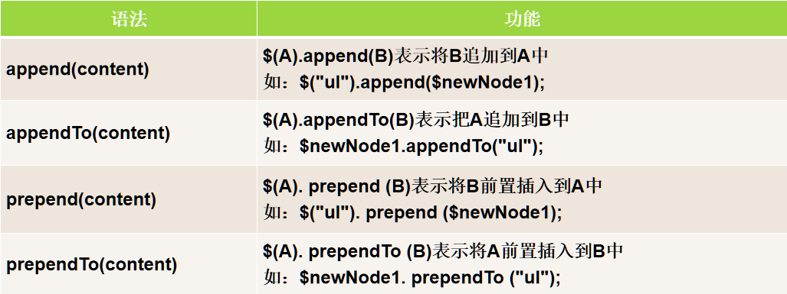
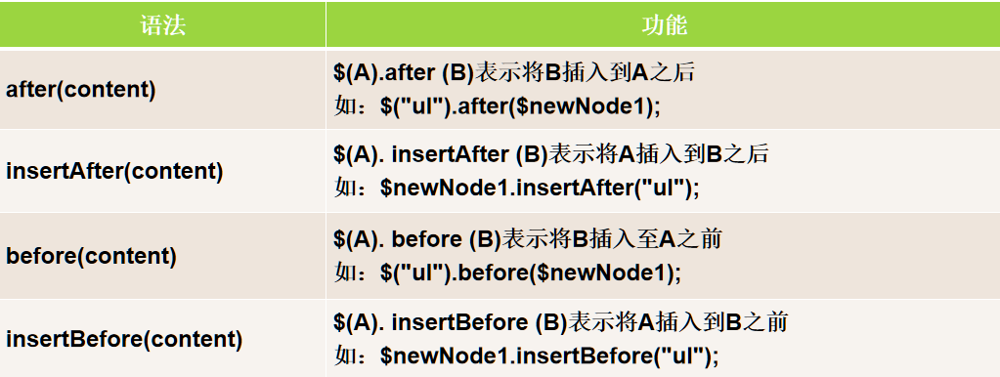
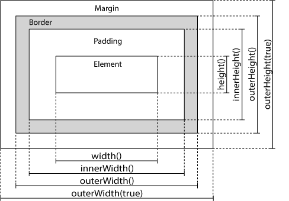
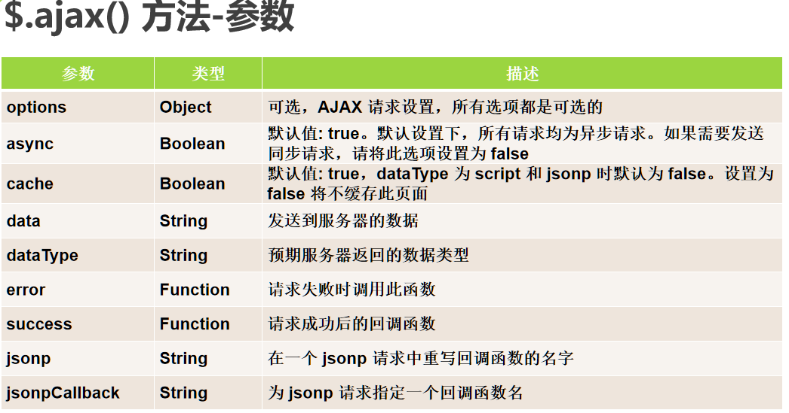

# jQuery

## 一、基础语法

① `$(selector).action()`：美元符号定义 jQuery，选择符（selector）"查询"和"查找" HTML 元素，jQuery 的 action() 执行对元素的操作

② 文档就绪事件

所有 jQuery 函数位于一个 document ready 函数中

```js
$(document).ready(function(){
   // 开始写 jQuery 代码...
});
```

简写：

```js
$(function(){
   // 开始写 jQuery 代码...
});
```

③ 链式调用

可以把动作/方法链接在一起

```js
$("#p1").css("color","red").slideUp(2000).slideDown(2000);
```

## 二、选择器

### 2.1、基本选择器:(5)

- 标签选择器：`$("tag")` ，tag:标签，选取所有tag名称的元素
- 类选择择器：`$(".class")`，选取所有.class的元素
- id选择器：`$("#dc")`，选取所有id="dc"的元素
- 并集选择器：`$("p,.class,#id")`，获得p,.class,#id三个元素
- 全局选择器：`$("*")`，获得所有元素

### 2.2、层次选择器:(4)

- 后代选择器：`$("div p")`，获得div的所有后代p元素
- 直接子元素选择器：`$("div>p")`，获得div的所有直接子后代
- 相邻元素选择器：`$("div+p")`，获得div后面直接相邻的的一个p元素
- 同辈元素选择器：`$("div~p")`，获得与div后与之成兄弟关系的所有p元素

### 2.3、属性选择器:(6)

- `[att]`：获得所有具有属性att的元素
- `[att='value']`：获得所有属性att值等于value的元素
- `[att^='value']`：获得所有属性att值以value开头的元素
- `[att$= 'value']`：获得所有属性att值以value结尾的元素
- `[att!= 'value']`：获得所有属性att值不等于value的元素
- `[att*= 'value']`：获得所有属性att值包含value的元素

### 2.4、基本过滤选择器:(11)

- `$("li:first")`：获得li的第1个元素
- `$("li:last")`：获得li的最后一个元素
- `$("li:odd")`：获得li的奇数元素
- `$("li:even")`：获得li的偶数元素
- `$("li:not(.l1)")`：获得li属性class值不等于li的元素
- `$("li:gt(index)")`：大于index的li元素
- `$("li:lt(index)")`：小于index的li元素
- `$("li:eq(index)")`：等于index的li元素
- `$(":header")`：获得所有的标题元素h1-h6
- `$(":focus")`：获得所有获得焦点的元素
- `$(":animated")`：获得所有动画元素

### 2.5、可见性过滤选择器:(2)

- `[:visible]`：选取所有可见的元素
- `[:hidden]`：选取所有隐藏的元素

## 三、事件

### 3.1 鼠标事件

- click([callback])
- dblclick([callback])
- mouseenter([callback])
- mouseleave([callback])
- hover([callback移入],[callback移除])
- dblclick([callback]) 

### 3.2 键盘事件

- keypress()
- keydown()
- keyup()

### 3.3 表单事件

- submit()
- change()
- focus()
- blur()

### 3.4 文档/窗口事件

- load()
- resize()
- scroll()
- unload()

## 四、动画效果

- 显示隐藏

  隐藏：`hide(speed,callback)`

  显示：`show(speed,callback)`

  切换：`toggle(speed,callback)`

- 滑动

  向下滑动：`slideDown(speed,callback)`

  向上滑动：`slideUp(speed,callback)`

  上下滑动切换：`slideToggle(speed,callback)`

- 淡入淡出

  淡入已隐藏的元素：`fadeIn(speed,callback)`

  淡出可见元素：`fadeOut(speed,callback)`

  淡入淡出切换：`fadeToggle(speed,callback)`

  渐变为给定的不透明度（值介于 0 与 1 之间）：`fadeTo(speed,opacity,callback)`

备注：可以不传参数；speed：时间单位ms，callback：缓动函数，"linear" 和 "swing"。

- 动画：`animate({params},speed,callback)`

  可选的 speed 参数规定隐藏/显示的速度，可以取以下值："slow"、"fast" 或毫秒。

  可选的 callback 参数是隐藏或显示完成后所执行的函数名称。

  ```javascript
  $("button").click(function(){
    $("div").animate({
      left:'250px',
      opacity:'0.5',
      height:'150px',
      width:'150px'
    });
  });
  ```

  params：必需的 params 参数定义形成动画的 CSS 属性，CSS 属性命名小驼峰

  - 定义相对值该值相对于元素的当前值）

    ```js
    $("button").click(function(){
      $("div").animate({
        left:'250px',
        height:'+=150px',
        width:'+=150px'
      });
    });
    ```

  - 预定义值

    ```js
    $("button").click(function(){
      $("div").animate({
        height:'toggle'
      });
    });
    ```

  动画队列

  ```js
  $("button").click(function(){
    var div=$("div");
    div.animate({height:'300px',opacity:'0.4'},"slow");
    div.animate({width:'300px',opacity:'0.8'},"slow");
    div.animate({height:'100px',opacity:'0.4'},"slow");
    div.animate({width:'100px',opacity:'0.8'},"slow");
  });
  ```

- 停止动画或效果：`stop(stopAll,goToEnd)`

  stopAl：可选的stopAll 参数规定是否应该清除动画队列。默认是 false，即仅停止活动的动画，允许任何排入队列的动画向后执行。

  goToEnd：可选的 goToEnd 参数规定是否立即完成当前动画。默认是 false。

## 五、DOM操作

### 5.1 内容/属性

内容

- `text() ` ：设置或返回所选元素的文本内容
- `html() `：设置或返回所选元素的内容（包括 HTML 标签）
- `val() `：设置或返回表单字段的值
- 传入参数或回调函数（return）可设置内容

属性

- 获取属性值：`attr('属性') `,eg:`$("#runoob").attr("href")`
- 设置属性值：`attr('属性','值')`，`attr({'属性1':'值1','属性2':'值2'})`，`attr(回调函数)`
- 删除属性：`removeAttr('属性')`
- 回调函数用法：回调函数有两个参数：被选元素列表中当前元素的下标，以及原始（旧的）值。然后以函数新值返回您希望使用的字符串。

### 5.2 节点操作

添加节点

- 

- 

克隆节点

-  `clone()`：参数true复制事件处理，false反之

删除元素

- `remove()`：删除被选元素（及其子元素）

- `remove('css')`：过滤被删除的元素

- `empty()`：从被选元素中删除子元素

替换节点

- `oldNode.replaceWith(newNode)`：旧的的节点被新节点替换

- `newNode.replaceAll(oldNode)`：新节点替换旧节点

### 5.3 操作 CSS

- `addClass('c1 c2 ...' | function(i, c))` -- 添加一个或多个类。

- `removeClass('c1 c2 ...' | function(i, c))` -- 删除一个或多个类。

- `toggleClass('c1 c2 ...' | function(i, c), switch?)` -- 切换一个或多个类的添加和删除。

- `hasClass('')`--是否包含类，返回布尔

- 注意：第一个参数表示要添加或删除的类，既可以用类列表，也可以用函数返回值指定（i 是选择器选中的所有元素中当前对象的索引值，c 是当前对象的类名）。switch: 布尔值，true 表示只添加，false 表示只删除。

- `css()` - 设置或返回样式属性

### 5.4 尺寸

- `width()`：设置或返回元素的宽度（不包括内边距、边框或外边距）

- `height()`：设置或返回元素的高度（不包括内边距、边框或外边距）

- `innerWidth()`：返回元素的宽度（包括内边距）

- `innerHeight()`：返回元素的高度（包括内边距）

- `outerWidth()`：返回元素的宽度（包括内边距和边框）

- `outerHeight()`：返回元素的高度（包括内边距和边框）



- `offset()： 返回以像素为单位的top和left坐标。仅对可见元素有效

- `offsetParent()`：返回最近的已定位祖先元素。

`position()`：返回第一个匹配元素相对于父元素的位置

- `scrollLeft()`： 设置或返回匹配元素相对滚动条左侧的偏移

- `scrollTop() ` ：设置或返回匹配元素相对滚动条顶

### 5.5 遍历

祖先

- `parent()`：返回被选元素的直接父元素。

- `parents()`：返回被选元素的所有祖先元素。

- `parentsUntil('元素')`：返回介于两个给定元素之间的所有祖先元素。

后代

- `children() `：方法返回被选元素的所有直接子元素。

  ```js
  // 返回类名为 "1" 的所有 <p> 元素，并且它们是 <div> 的直接子元素
  $("div").children("p.1");
  ```

- `find() `：方法返回被选元素的后代元素，一路向下直到最后一个后代。

  ```js
  // 返回属于 <div> 后代的所有 <span> 元素
  $("div").find("span");
  // 返回 <div> 的所有后代
  $("div").find("*")
  ```

同胞

- `siblings()`：返回被选元素的所有同胞元素。

  ```js
  // 返回属于 <h2> 的同胞元素的所有 <p> 元素
  $("h2").siblings("p");
  ```

- `next()`返回被选元素的下一个同胞元素

- `nextAll()：`：返回被选元素的所有跟随的同胞元素

- `nextUntil()`：返回介于两个给定参数之间的所有跟随的同胞元素

  ```js
  // 返回介于 <h2> 与 <h6> 元素之间的所有同胞元素
  $("h2").nextUntil("h6")
  ```

- `prev()`、`prevAll()`、`prevUntil()`

过滤

- `first()`： 方法返回被选元素的首个元素

- `last() `：方法返回被选元素的最后一个元素。

- `eq() `：方法返回被选元素中带有指定索引号的元素

  ```js
  // 选取第二个 <p> 元素（索引号 1）
  $("p").eq(1);
  ```

- `filter() `：方法允许您规定一个标准。不匹配这个标准的元素会被从集合中删除，匹配的元素会被返回。

  ```js
  // 返回带有类名 "url" 的所有 <p> 元素
   $("p").filter(".url");
  ```

- `not()`：方法与 filter() 相反。

- `each() `：遍历jquery对象，数组，普通对象的方法

- `end()`：结束当前链条中的最近的筛选操作，并将匹配元素集还原为之前的状态

- `index()`：找当前元素在集合中的下标

## 六、AJAX



```js
 $(function () {
      $('.login-btn').click(function () {
        let userPassword = $('.password').val()
        let username = $('.username').val()
        $.ajax({
          url: 'http://146.56.230.35:3007/users/login',
          type: 'POST',
          data: { username, userPassword },
          headers: {},
          // 请求成功的函数
          success(res) {
            if (res.code !== 200) {
              return console.log(res.msg)
            }
            console.log(res.msg)
            sessionStorage.setItem('login-user', JSON.stringify(res))
            location = './2-get.html'
          },
          // 请求失败的函数
          error(err) {
            console.log(err)
          },
        })
      })
    })
```

GET请求：`$.get( URL [, data ] [, callback ] [, dataType ] )`

```js
//获取保存在sessionStorage中token
      function getToken() {
        let str = sessionStorage.getItem('login-user')
        if (!str) {
          return ''
        }
        return JSON.parse(str).token
      }
      function renderList(list) {
        console.log(list);
      }
      function getUserList() {
        //全局的ajax配置
        $.ajaxSetup({
          //设置请求头
          headers: { token: getToken() },
        })
        let url = 'http://146.56.230.35:3007/users/userList'
        let data = {
          page: 1,
          pageSize: 10
        }
        // ajax的get请求
        $.get(url, data, function (res) {
          if (res.code !== 200) {
            return console.log(res.msg)
          }
          let list = res.data.list
          let count = res.data.count
          renderList(list)
        })
      }
      $(function () {
        getUserList()
      })
```

POST请求：`$.post( URL [, data ] [, callback ] [, dataType ] )`

```js
 $(function () {
      $('.login-btn').click(function () {
        $.post(
          // url地址
          'http://146.56.230.35:3007/users/login-btn',
          // data数据
          {
            username: $('.username').val(),
            userPassword: $('.password').val()
          },
          //success 回调函数
          function (res) {
            console.log(res)
          })
      })
    })
```

## 七、其他

插件库：[jq插件库](https://www.jq22.com/)

定制化

- `$.extend()`：用于将一个或多个对象的内容合并到目标对象
- `$.fn.extend()`：为jQuery扩展一个或多个实例属性和方法