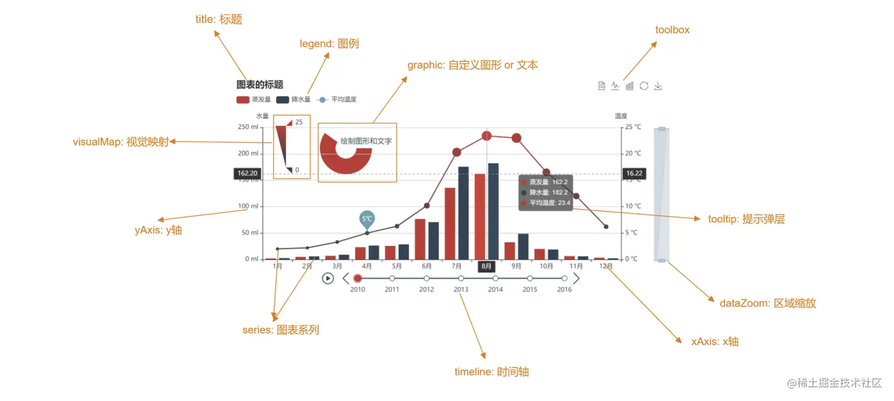

# ECharts

## 一、初识

简介：一个基于 JavaScript 的开源可视化图表库。

官方网站：[ECharts](https://echarts.apache.org/zh/index.html)

社区网站：[isqqw](https://www.isqqw.com/?t=pie) [makeapie](https://www.makeapie.cn/echarts)

vscode 插件：[echarts-enhanced-completion](https://github.com/ren-wei/echarts-enhanced-completion/blob/master/README_zh-cn.md)

快速了解功能名称，帮助定位到配置项手册：[术语速查手册](https://echarts.apache.org/zh/cheat-sheet.html)

地图数据：https://datav.aliyun.com/portal/school/atlas/area_selector#&lat=30.332329214580188&lng=106.72278672066881&zoom=3.5

## 二、起步

1. 获取 echarts 并在 项目中导入

   ```sh
   npm install echarts
   ```

   ```js
   import * as echarts from "echarts";
   ```

2. 准备一个具备大小的 DOM 容器

   ```html
   <div id="main" style="width: 600px;height:400px;"></div>
   ```

3. 初始化 echarts 实例对象

   ```js
   var myChart = echarts.init(document.getElementById("main"));
   ```

4. 指定配置项和数据(option)

   ```js
   var option = {
     // ......
   };
   ```

5. 将配置项设置给 echarts 实例对象

   ```js
   myChart.setOption(option);
   ```

## 三、基础配置项



详见：[术语速查手册](https://echarts.apache.org/zh/cheat-sheet.html)

1. `color`：调色盘颜色列表；可设置线条的颜色
2. `title`：图表的标题
3. `tooltip`：提示框组件
4. `legend`：图例组件；series 里面有了 name 值则 legend 里面的 data 可以删掉
5. `toolbox`：工具箱组件；可以另存为图片等功能
6. `grid`：网格配置； grid 可以控制线形图 柱状图 图表大小
7. `xAxis`：设置 x 轴的相关配置
8. `yAxis`：设置 y 轴的相关配置
9. `series`：系列图表配置；它决定着显示哪种类型的图表
