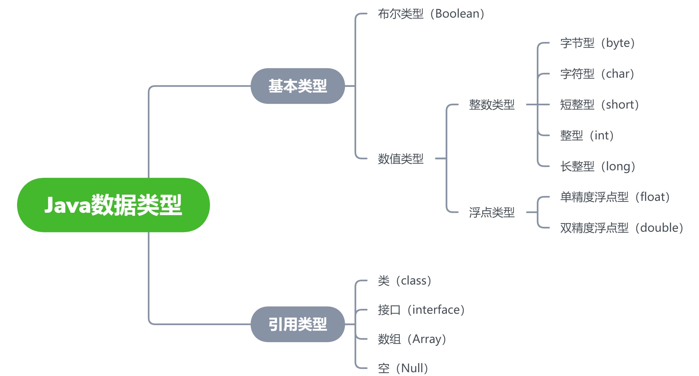
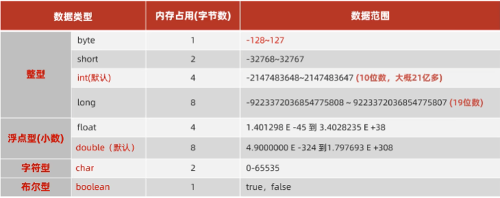

# Java

## 一、快速上手

1. JDK下载安装：[官网](https://www.oracle.com/java/technologies/downloads/)

2. [配置环境变量](https://blog.csdn.net/qq_40687540/article/details/115212035)

3. cmd常用命令

   ```java
   E:  //切换到E盘
   cd [目录]        //进入指定的目录
   cd ..         //退回到上一级目录
   cd /         //退回到根目录
   dir             //显示当前目录下所有的内容
   cls             //清空屏幕
   ```

4. Java程序中常见的问题

   - 文件名和类名不一致
   - 英文大小写错误，单词拼写错误，存在中文符号，找不到main方法
   - 括号不配对

5. JDK的组成

   

6. Java开发工具

   主推[Intellij IDEA](https://www.jetbrains.com//idea/download/#section=windows)

   常用快捷键：

   - `Ctrl + ALT + L` ：格式化代码
   - `Ctrl + /` ：单行注释
   - `Ctrl + Shift + /`：多行注释

7. Hello World

   1. 启动 IntelliJ IDEA，创建新项目（project）。
   2. 依次创建模块（module）→ 包（package） → 类（class）
   3. 编写代码，并运行

## 二、基础语法

### 2.1 变量

定义变量：数据类型 变量名称 = 数据；

eg：int age = 18；

### 2.2 数据类型



#### 2.2.1 基本数据类型



```java
/* 一、整型 */
	// 1.1、byte
	byte a = 127;
	// 1.2、short
	short b = 13244;
	// 1.3、int 默认
	int c = 20;
	// 注意：随便写一个整型字面量默认为int类型
	// 1.4、long
	long d = 123456789L;
	// 注意：希望整型字面量是 long 类型，需要在后面添加l或L

/* 二、浮点型 */
	// 2.1 float
	float f = 3.14F;
	// 注意：小数字面量，默认是 double ，希望是 float 需要在后面添加f或F
	// 2.2 double 默认
	double g = 99.5;

/* 三、字符型 */
	char h = 'A';

/* 四、布尔型 */
	boolean i = true;
```

##### 2.2.1.1 类型转换

- 自动类型转换

  概念：**类型范围小**的变量可以**直接赋值**给**类型大的变量**

  ```sh
  低  ------------------------------------>  高
  
  byte,short,char—> int —> long—> float —> double 
  ```

  ```java
  /* 一、自动类型转换 */
  byte a = 12;
  int b = a;
  System.out.println(b);
  ```

- 表达式的类型转换

  概念：在表达式中，小范围类型的变量，会自动转换成表达式中较大范围的类型，再参与运算。

  注意：

  1. 表达式的最终结果类型由表达式中的**最高类型决定**；
  2. 在表达式中，**byte、short、char** 是**直接转换成int类型**参与运算。

- 强制类型转换

  概念：范围类型大的变量或数据，赋值给类型范围小的变量

  格式：数据类型 变量2 = （数据类型）变量1、数据

  快捷键：Alt+Enter

  注意：

  1. 强制类型转换可能造成数据（丢失）溢出；
  2. 浮点型强转成整型，直接丢失小数部分，保留整数部分返回。

  ```java
  /* 三、强制类型转换 */
  int i = 102;
  byte j = (byte) i;
  ```

##### 2.2.1.2 运算符

- 基本运算符

  | 符号 | 作用 |            说明            |
  | :--: | :--: | :------------------------: |
  |  +   |  加  | 与**字符串**运算可做连接符 |
  |  -   |  减  |                            |
  |  *   |  乘  |                            |
  |  /   |  除  |   整数相除的结果还是整数   |
  |  %   | 取余 |                            |

- 自增/自减/赋值运算符

  注意：扩展赋值运算符会进行强制类型转换

  ```java
  int m = 3;
  int n = 2;
  m %= n; // 等价 m = (int) (m % n)
  ```

- 关系运算符

  ​	返回布尔值

- 逻辑运算符

  | 符号 |   叫法   |       例子       |                           运算逻辑                           |
  | :--: | :------: | :--------------: | :----------------------------------------------------------: |
  |  &   |  逻辑与  |  2 > 1 & 3 > 2   | 多个条件必须都是true，结果才是true；有一个是false，结果为false |
  |  \|  |  逻辑或  |  2 > 1 \| 3 < 5  |              多个条件有一个是true，结果才是true              |
  |  !   |  逻辑非  |    ! (2 > 1)     |                             取反                             |
  |  ^   | 逻辑异或 |  2 > 1 ^ 3 > 1   |       前后结果相同，返回false；前后结果不同，返回true        |
  |  &&  |  短路与  | 2 > 10 && 3 > 2  |          判断结果与 & 一样，左边为false，右边不执行          |
  | \|\| |  短路或  | 2 > 1 \|\| 3 < 5 |          判断结果与 \| 一样，左边为true，右边不执行          |

- 三元运算符

  格式：`条件表达式 ? 值1 : 值2`

- 运算符优先级

#### 2.2.2 引用数据类型

```java
/* 一、字符串型 */
	String j = "Hello World";
```

### 2.3 语句

#### 2.3.1 分支结构

##### 2.3.1.1 if

- if 语句

  ```java
  if(布尔表达式)
  {
     //如果布尔表达式为true将执行的语句
  }
  ```

  注意：如果if语句只有一行代码，{} 可省略，但不推荐

- if...else语句

  ```java
  if(布尔表达式){
     //如果布尔表达式的值为true
  }else{
     //如果布尔表达式的值为false
  }
  ```

- if...else if...else 语句

  ```java
  if(布尔表达式 1){
     //如果布尔表达式 1的值为true执行代码
  }else if(布尔表达式 2){
     //如果布尔表达式 2的值为true执行代码
  }else if(布尔表达式 3){
     //如果布尔表达式 3的值为true执行代码
  }else {
     //如果以上布尔表达式都不为true执行代码
  }
  ```

##### 2.3.1.2 switch

```java
switch(expression){
    case value :
       //语句
       break; //可选
    case value :
       //语句
       break; //可选
    //你可以有任意数量的case语句
    default : //可选
       //语句
}
// expression即变量；value对应的值
```

注意：switch 语句中的变量类型可以是： **byte、short、int 或者 char**。从 Java SE 7 开始，switch 支持字符串 String 类型了，同时 case 标签必须为字符串常量或字面量。

利用 switch 穿透 简化代码（见 B 和 C）；场景：case内代码相同

```java
public class Test {
   public static void main(String args[]){
      //char grade = args[0].charAt(0);
      char grade = 'C';
 
      switch(grade)
      {
         case 'A' :
            System.out.println("优秀"); 
            break;
         case 'B' :
         case 'C' :
            System.out.println("良好");
            break;
         case 'D' :
            System.out.println("及格");
            break;
         case 'F' :
            System.out.println("你需要再努力努力");
            break;
         default :
            System.out.println("未知等级");
      }
      System.out.println("你的等级是 " + grade);
   }
}
```

#### 2.3.2 循环结构

##### 2.3.2.1 for

```java
for(初始化; 布尔表达式; 更新) {
    //代码语句
}
```

示例：

```java
public class Test {
   public static void main(String[] args) {
 
      for(int i = 10; i < 20; i++) {
         System.out.print("value of i : " + i );
         System.out.print("\n");
      }
   }
}
```

##### 2.3.2.2 while

```java
while( 布尔表达式 ) {
  //循环内容
}
```

注意：只要**布尔表达式为 true**，循环就会一直执行下去。

示例：

```java
public class Test {
   public static void main(String[] args) {
      int i = 10;
      while( i < 20 ) {
         System.out.print("value of i : " + i );
         i++;
         System.out.print("\n");
      }
   }
}
```

##### 2.3.2.3 do-while

对于 while 语句而言，如果不满足条件，则不能进入循环，do…while 循环至少会执行一次。布尔表达式为 true，循环会一直执行。

```java
do {
       //代码语句
}while(布尔表达式);
```

示例：

```java
public class Test {
   public static void main(String[] args){
      int x = 10;
 
      do{
         System.out.print("value of x : " + x );
         x++;
         System.out.print("\n");
      }while( x < 20 );
   }
}
```

#### 2.3.3 跳转关键字

- break

  主要用在循环语句或者 switch 语句中，用来跳出整个语句块，并且继续执行该循环下面的语句。

- continue

  用于任何循环控制结构中。作用是让程序立刻跳转到下一次循环的迭代。
