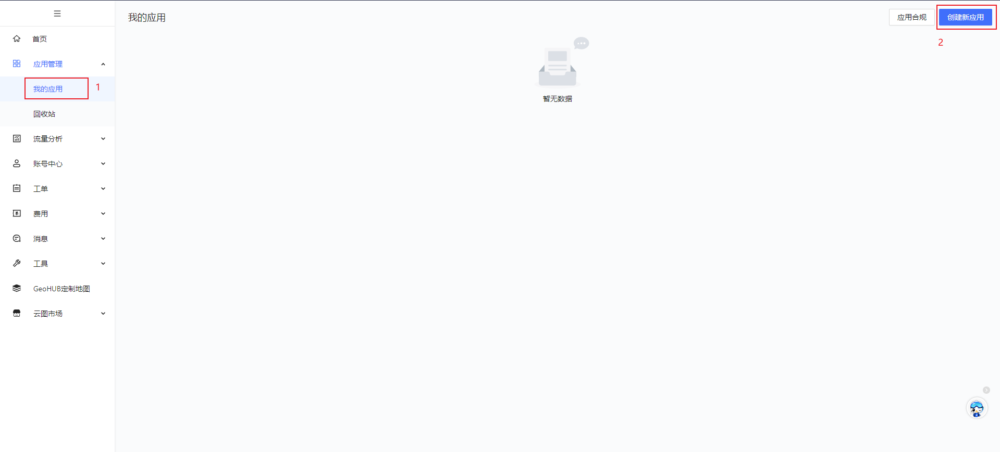

# vue2+高德地图

## 一、准备工作

1. 注册并登录[高德地图开放平台](https://lbs.amap.com/)

2. 申请密钥

   控制台 → 我的应用 → 创建新应用 → 添加key

   

3. [创建vue2项目并安装高德地图加载器](https://lbs.amap.com/api/javascript-api-v2/guide/abc/amap-vue)

   ```sh
   vue create demo
   npm i @amap/amap-jsapi-loader --save
   ```

4. [入门文档](https://lbs.amap.com/api/javascript-api-v2/summary)

5. [api文档](https://lbs.amap.com/api/javascript-api-v2/documentation#map)

6. 注意事项

   如果是移动端开发添加：

   ```html
   <meta name="viewport" content="initial-scale=1.0, user-scalable=no" />
   ```

## 二、业务开发

```vue
<template>
  <div id="mapContainer" />
</template>

<script>
import AMapLoader from "@amap/amap-jsapi-loader";
let AMap, geolocation;
export default {
  data() {
    return {
      map: null,
    };
  },
  mounted() {
    this.initAMap();
  },
  unmounted() {
    this.map?.destroy();
  },
  methods: {
    // 初始化地图
    initAMap() {
      window._AMapSecurityConfig = {
        securityJsCode: "d65c0f71bbc7c4ed045ccf33fa76f477", // 安全密钥
      };
      AMapLoader.load({
        key: "4b3a70c93289783a5f0a1bed455ee9a7", // Key
        version: "2.0", // 指定要加载的 JSAPI 的版本，缺省时默认为 1.4.15
        // 需要使用的的插件列表，使用：this.map.addControl(new ...)
        // https://lbs.amap.com/api/javascript-api-v2/guide/abc/plugins-list
        plugins: [
          "AMap.Scale",
          "AMap.ToolBar",
          "AMap.MapType",
          "AMap.HawkEye",
          "AMap.Geolocation",
          "AMap.CitySearch",
        ],
      })
        .then((A) => {
          AMap = A;
          // 创建地图实例
          this.map = new AMap.Map(
            "mapContainer", // 设置地图容器id
            {
              viewMode: "2D", // 是否为3D地图模式
              zoom: 11, // 初始化地图级别
            }
          );
          // #region 插件注册
          this.map.addControl(new AMap.Scale()); // 添加比例尺
          this.map.addControl(new AMap.ToolBar()); // 添加工具栏
          this.map.addControl(new AMap.MapType()); // 添加地图类型切换插件
          this.map.addControl(new AMap.HawkEye()); // 添加鹰眼插件
          // #endregion

          // #region 获取定位
          // 注册定位插件
          geolocation = new AMap.Geolocation({
            enableHighAccuracy: true, //是否使用高精度定位，默认:true
            timeout: 10000, //超过10秒后停止定位，默认：5s
            position: "RB", //定位按钮的停靠位置
            offset: [10, 20], //定位按钮与设置的停靠位置的偏移量，默认：[10, 20]
            zoomToAccuracy: true, //定位成功后是否自动调整地图视野到定位点
          });
          this.map.addControl(geolocation);
          // 获取当前精确位置
          this.getLoc();
          // #endregion
          this.addMarker();
          this.drawPolygon();
          // 添加点击事件
          this.map.on("click", this.mapClick);
        })
        .catch((e) => {
          console.log(e);
        });
    },
    // 获取定位信息
    getLoc() {
      geolocation.getCurrentPosition(function (status, result) {
        let info = {};
        if (status == "complete") {
          info = {
            status: "定位成功",
            position: result.position, // 定位结果
            location_type: result.location_type, // 定位类别
            accuracy: result.accuracy || "", // 精度
            isConverted: result.isConverted, // 是否经过偏移、
            lngLat: [result.position.lng, result.position.lat], // 经纬度
          };
        } else {
          info = {
            status: "定位失败",
            message: result.message, // 失败原因排查信息
            originMessage: result.originMessage, // 浏览器返回信息
          };

          // 获取当前城市信息
          const citySearch = new AMap.CitySearch();
          citySearch.getLocalCity(function (status, result) {
            if (status === "complete" && result.info === "OK") {
              // 查询成功，result即为当前所在城市信息
              console.log(result);
            }
          });
        }
        console.log(info);
      });
    },
    // 地图点击事件
    mapClick(ev) {
      // 经度值：lng,纬度值：lat
      const { lng, lat } = ev.lnglat;
      console.log(lng, lat);
    },
    // 添加标记点
    addMarker() {
      const marker1 = new AMap.Marker({
        position: new AMap.LngLat(117.139272, 31.827144), // 经纬度对象，也可以是经纬度构成的一维数组[116.39, 39.9]
        title: "公司",
      });
      const markerList = [marker1];
      this.map.add(markerList);
    },
    // 多边形覆盖物绘制
    drawPolygon() {
      const path = [
        [117.138373, 31.827497],
        [117.139398, 31.827493],
        [117.139496, 31.82742],
        [117.139499, 31.826014],
        [117.138354, 31.826008],
      ];
      const polygon = new AMap.Polygon({
        path: path,
        strokeColor: "red", // 轮廓线颜色
        strokeWeight: 6,
        strokeOpacity: 0.2,
        fillOpacity: 0.4,
        fillColor: "#1791fc",
        zIndex: 50,
        bubble: true,
      });
      this.map.add([polygon]);
      this.map.setFitView();
    },
  },
};
</script>

<style lang="less">
#mapContainer {
  width: 100%;
  height: 800px;
  // 隐藏高德地图logo及版权信息
  .amap-logo,
  .amap-copyright {
    display: none !important;
  }
}
</style>
```
