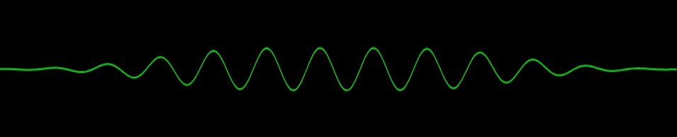

# 需求实现

## 1、在vue中封装时间实时刷新

### 1.1 vue中使用mixins

①  利用 mixins 封装

```js
// mixins/formatdate.js
import dayjs from 'dayjs'
export default {
  data() {
    return {
      currentTime: {
        timer: null,
        currentDay: this.formatTime().day, // 星期几
        date: this.formatTime().date, // 年月日
        time: this.formatTime().time, // 时分秒
      },
    }
  },
  mounted() {
    this.timer = setInterval(() => {
      this.updateTime()
    }, 1000)
  },
  methods: {
    formatTime(d = 'YYYY.MM.DD', t = 'HH:mm:ss') {
      let days = ['日', '一', '二', '三', '四', '五', '六']
      let date = dayjs(new Date()).format(d)
      let time = dayjs(new Date()).format(t)
      let day = `星期${days[dayjs().day()]}`
      return { date, time, day }
    },
    updateTime() {
      this.currentTime.currentDay = this.formatTime().day
      this.currentTime.date = this.formatTime().date
      this.currentTime.time = this.formatTime().time
    },
  },
  beforeDestroy() {
    clearInterval(this.timer)
  },
}
```

② 在组件中使用

```vue
<span>{{ currentTime.date }}</span>
<span>{{ currentTime.currentDay }}</span>
<span>{{ currentTime.time }}</span>
<script>
import formatdate from '@/mixins/formatdate'
export default {
  mixins: [formatdate],
}
</script>
```

### 1.2 在vue3中使用组合式函数

定义：

```js
// formatTime.js
import dayjs from 'dayjs'
import { onBeforeUnmount, onMounted, ref } from 'vue'
export function useTime() {
  // 星期几
  const currentDay = ref('')
  // 年月日
  const date = ref('')
  // 时分秒
  const time = ref('')
  // 获取时间
  const updateTime = (d = 'YYYY.MM.DD', t = 'HH:mm:ss') => {
    let days = ['日', '一', '二', '三', '四', '五', '六']
    date.value = dayjs(new Date()).format(d)
    time.value = dayjs(new Date()).format(t)
    currentDay.value = `星期${days[dayjs().day()]}`
  }
  // 定义定时器
  let timer = null
  onMounted(() => {
    timer.value = setInterval(() => {
      updateTime()
    }, 1000)
  })
  onBeforeUnmount(() => clearInterval(timer))
  return { currentDay, date, time }
}
```

在组件中使用

```html
<script setup>
import { useTime } from '@/utils/formatTime'
const { currentDay, date, time } = useTime()
</script>
```

## 2、在vue2使用[vue-count-to](https://www.npmjs.com/package/vue-count-to) 实现数字滚动

安装：

```sh
npm i vue-count-to
```

在组件中使用

```vue
<template>
  <countTo :startVal='startVal' :endVal='endVal' :duration='3000'></countTo>
</template>
 
<script>
  import countTo from 'vue-count-to';
  export default {
    components: { countTo },
    data () {
      return {
        startVal: 0,
        endVal: 2017
      }
    }
  }
</script>
```

## 3、tabs切换

```vue
<template>
    <div class="tabs">
      <ul>
        <li
          v-for="(item, index) in ['tab1', 'tab2', 'tab3']"
          :key="index"
          @click="tabClick(item, index)"
          :class="{ active: currentIndex === index }"
        >
          {{ item }}
        </li>
      </ul>
      <div class="cont">
        <div v-show="currentIndex === 0">tab1</div>
        <div v-show="currentIndex === 1">tab2</div>
        <div v-show="currentIndex === 2">tab3</div>
      </div>
    </div>
</template>

<script>
export default {
  data() {
    return { currentIndex: 0 }
  },
  methods: {
    tabClick(item, index) {
      this.currentIndex = index
      // console.log(item)
    },
  },
}
</script>

<style scoped lang="less">
    .tabs ul .active{
        color:red;
    }
</style>

```

## 4、在vue2使用[swiper](https://www.swiper.com.cn/api/index.html)

方案一：

安装：

```sh
npm install vue-awesome-swiper@4.1.1 --save
```

示例参考：https://v1.github.surmon.me/vue-awesome-swiper/

在组件中使用：

```vue
<template>
  <swiper class="swiper" :options="swiperOption">
    <swiper-slide v-for="index in 6" :key="index">Slide {{ index + 1 }}</swiper-slide>
  </swiper>
</template>

<script>
import { Swiper, SwiperSlide } from 'vue-awesome-swiper';
import 'swiper/css/swiper.css';
export default {
  components: {
    Swiper,
    SwiperSlide,
  },
  data() {
    return {
      swiperOption: {
        // direction: 'horizontal',
        slidesPerView: 1,
        loop: true,
        autoplay: {
          delay: 2000,
          disableOnInteraction: false,
        },
      }
    }
  },

}

</script>

<style scoped lang="less">
.swiper {
  height: 300px;

  .swiper-slide {
    background-color: rebeccapurple;
  }
}
</style>
```

方案二：

安装：

```bash
npm i swiper@5.4.5
```

封装：

```vue
<template>
  <div ref="swiper" class="swiper-container" :style="{ height }" @mouseenter="stopAutoplay" @mouseleave="autoplay">
    <div class="swiper-wrapper">
      <div class="swiper-slide" v-for="(item, index) in dataList" :key="index">
        <slot :item="item" />
      </div>
    </div>
  </div>
</template>

<script>
import Swiper from 'swiper'
import 'swiper/css/swiper.min.css'

export default {
  props: {
    height: {
      type: String,
      default: '100px'
    },
    dataList: {
      type: Array,
      default: () => [],
    },
    config: {
      type: Object,
      default: () => ({}),
    }
  },
  data() {
    return { swiper: null }
  },
  mounted() {
    const that = this
    this.swiper = new Swiper(this.$refs.swiper, {
      ...this.config, on: {
        slideChange: function () {
          that.$emit('slideChange', this.isBeginning, this.isEnd)
        }
      }
    })
  },
  methods: {
    next() {
      this.swiper && this.swiper.slideNext()
    },
    prev() {
      this.swiper && this.swiper.slidePrev()
    },
    autoplay() {
      this.swiper && this.swiper.autoplay.start()
    },
    stopAutoplay() {
      this.swiper && this.swiper.autoplay.stop()
    }
  },
  beforeDestroy() {
    this.swiper && this.swiper.destroy()
  },
}
</script>

<style scoped lang="scss">
.swiper-container {
  width: 100%;
}
</style>

```

在组件中使用：

```vue
<swiper ref="swiper2" v-slot="{ item }" height="450px" :data-list="dataList" :config="{ slidesPerView: 4, autoplay: { delay: 6000, disableOnInteraction: false } }" @slideChange="slideChange" >
	<div class="activity">{{ item }}</div>
</swiper>
```

## 5、在react中使用[swiper](https://www.swiper.com.cn/api/index.html)

安装：

```sh
npm i swiper@6.8.4
```

在组件中使用：

```jsx
import { Swiper, SwiperSlide } from 'swiper/react';
import SwiperCore, { Virtual, Autoplay } from 'swiper';
import 'swiper/swiper-bundle.css';
SwiperCore.use([Virtual, Autoplay]);
export default function SwiperText() {
  return (
    <Swiper
      direction="vertical"
      loop={true}
      autoplay={{ delay: 3000 }}
      spaceBetween={10}
      slidesPerView={2}
      slidesPerGroup={2}
    >
        <SwiperSlide >Slide1</SwiperSlide>
        <SwiperSlide >Slide2</SwiperSlide>
        <SwiperSlide >Slide3</SwiperSlide>
    </Swiper>
  );
}
```

## 6、[vue-seamless-scroll](https://chenxuan0000.github.io/vue-seamless-scroll/zh/)  实现表格滚动

安装：

```sh
npm install vue-seamless-scroll --save
```

在组件中使用：

```vue
<template>
  <div class="content">
    <div class="header">
      <div
        v-for="(item, index) in tableHeader"
        :key="index"
        class="header-item"
      >
        {{ item }}
      </div>
    </div>
    <div class="body">
      <vue-seamless-scroll :data="tableData" :class-option="{ step: 0.5 }">
        <ul>
          <li v-for="(item, index) in tableData" :key="index" class="body-item">
            <div>
              <el-tooltip :content="item.time" placement="top" effect="light">
                <p>{{ item.time }}</p>
              </el-tooltip>
            </div>
            <div>
              <el-tooltip :content="item.county" placement="top" effect="light">
                <p>{{ item.county }}</p>
              </el-tooltip>
            </div>
            <div>
              <el-tooltip :content="item.level" placement="top" effect="light">
                <p>{{ item.level }}</p>
              </el-tooltip>
            </div>
            <div>
              <el-tooltip :content="item.kq" placement="top" effect="light">
                <p>{{ item.kq }}</p>
              </el-tooltip>
            </div>
            <div>
              <el-tooltip
                :content="item.content"
                placement="top"
                effect="light"
              >
                <p>{{ item.content }}</p>
              </el-tooltip>
            </div>
          </li>
        </ul>
      </vue-seamless-scroll>
    </div>
  </div>
</template>

<script>
import vueSeamlessScroll from "vue-seamless-scroll";
export default {
  components: { vueSeamlessScroll },
  props: {
    tableData: {
      type: Array,
      default: () => [],
    },
    tableHeader: {
      type: Array,
      default: () => [],
    },
  },
};
</script>

<style scoped lang="scss">
.content {
  width: 100%;
  height: 100%;
  .header {
    display: grid;
    grid-template-columns: repeat(5, 1fr);
    gap: 5px;
    color: #fff;
    font-size: 16px;
    text-align: center;
    > div {
      padding: 3px 0;
    }
  }
  .body {
    width: 100%;
    height: 226px;
    overflow: hidden;
    li {
      display: grid;
      grid-template-columns: repeat(5, 1fr);
      padding: 5px 0;
      gap: 5px;
      color: #899dbf;
      font-size: 14px;
      text-align: center;
      > div {
        overflow: hidden;
        p {
          width: 100%;
          overflow: hidden;
          white-space: nowrap;
          text-overflow: ellipsis;
        }
      }
    }
    li:nth-of-type(odd) {
      background-color: rgba(3, 27, 52, 0.6);
    }
  }
}
</style>
```

## 7、vue2实现滚动锚点

```vue
<template>
  <el-container class="home">
    <el-aside width="200px" class="aside">
      <ul>
        <li v-for="(item, index) in list" :key="index" :class="{ active: active === index }" @click="scrollTo(index)">{{
          item }}</li>
      </ul>
    </el-aside>
    <el-main ref="scrollBox" class="main" @scroll.native="handleScroll">
      <div class="content">
        content-0
      </div>
      <div class="content">
        content-1
      </div>
      <div class="content" style="height: 1000px;">
        content-2
      </div>
    </el-main>
  </el-container>

</template>

<script>
export default {
  data() {
    return {
      list: ['content-0', 'content-1', 'content-2'],
      active: 0
    }
  },

  methods: {
    handleScroll() {
      const scrollHeight = this.$refs.scrollBox.$el.scrollTop
      const offsetTops = Array.from(this.$refs.scrollBox.$el.querySelectorAll('.content')).map(item => item.offsetTop)
      offsetTops.forEach((item, index) => {
        if (scrollHeight >= item - 200) {
          this.active = index
        }
      })
    },
    scrollTo(index) {
      this.active = index
      const offsetTops = Array.from(this.$refs.scrollBox.$el.querySelectorAll('.content')).map(item => item.offsetTop)
      this.$refs.scrollBox.$el.scrollTop = offsetTops[index] - 100
    }
  }
}
</script>

<style lang="scss" scoped>
.home {
  width: 100%;
  height: 100%;
  background-color: #f6f7fb;
  padding: 15px;

  .aside {
    background-color: #fff;
    margin-right: 10px;
    border: 1px solid #e8e8e8;
    padding: 5px;

    ul {
      width: 100%;
      height: 100%;
      overflow-x: hidden;
      overflow-y: auto;
      padding: 10px 20px;

      li {
        font-size: 14px;
        width: 100%;
        padding: 7px 0;
        cursor: pointer;
        text-align: center;
        border: 1px solid #e8e8e8;
      }

      li+li {
        margin-top: 10px;
      }

      .active {
        background-color: #84d4f6;
        color: #fff;
      }
    }
  }

  .main {
    background-color: #fff;
    border: 1px solid #e8e8e8;
    overflow-x: hidden;
    overflow-y: auto;
    scroll-behavior: smooth; // 平滑滚动
    .content {
      width: 100%;
      height: 500px;
    }

    .content:nth-of-type(odd) {
      background-color: pink;
    }

    .content:nth-of-type(even) {
      background-color: red;
    }
  }
}
</style>
```

## 8、vue2实现点击粘贴复制功能

插件官网：[clipboard](https://clipboardjs.com/)

装包

```sh
npm install --save vue-clipboard2
```

注册

```js
import VueClipboard from 'vue-clipboard2'
Vue.use(VueClipboard)
```

使用

```vue
<template>
	<div @click="copy('message')">点击复制</div>
</template>
<script>
export default {
    methods: {
    copy(text) {
      this.$copyText(text).then(
        () => {
          this.$message.success('复制成功')
        },
        () => {
          this.$message.error('复制失败')
        }
      )
    }
  }
}
</script>
```

vue3使用 vue-clipboard3

## 9、el-table 组件的二次封装

封装

```vue
<template>
  <el-table border :data="tableData" style="width: 100%" size="small">
    <el-table-column
      v-for="(item, index) in column"
      :key="index"
      :prop="item.prop"
      :label="item.label"
      :show-overflow-tooltip="true"
      align="center"
    >
      <template #default="{row}">
        <slot :row="row" :prop="item.prop">{{ row[item.prop] }}</slot>
      </template>
    </el-table-column>
  </el-table>
</template>

<script>
export default {
  props: {
    tableData: {
      type: Array,
      required: true,
      default: () => []
    },
    column: {
      type: Array,
      required: true,
      default: () => []
    }
  }
}
</script>

<style scoped lang='less'>
</style>
```

使用

```vue
<Table v-slot="{row,prop}" :table-data="data" :column="column">
	<span v-if="prop==='detail'" class="btn" @click="viewDetail(row)">{{ row.detail }}</span>
	<span v-else>{{ row.fill }}</span>
</Table>
```

## 10、elememt-plus collapse-transition组件源码

```vue
<script setup>
import { ref } from 'vue'
const isFold = ref(false)
const reset = (el) => {
  el.style.maxHeight = ''
  el.style.overflow = el.dataset.oldOverflow
  el.style.paddingTop = el.dataset.oldPaddingTop
  el.style.paddingBottom = el.dataset.oldPaddingBottom
}
const on = {
  beforeEnter(el) {
    if (!el.dataset) el.dataset = {}
    el.classList.add('collapse-transition')
    el.dataset.oldPaddingTop = el.style.paddingTop
    el.dataset.oldPaddingBottom = el.style.paddingBottom
    if (el.style.height) el.dataset.elExistsHeight = el.style.height

    el.style.maxHeight = 0
    el.style.paddingTop = 0
    el.style.paddingBottom = 0
  },
  enter(el) {
    requestAnimationFrame(() => {
      el.dataset.oldOverflow = el.style.overflow
      if (el.dataset.elExistsHeight) {
        el.style.maxHeight = el.dataset.elExistsHeight
      } else if (el.scrollHeight !== 0) {
        el.style.maxHeight = `${el.scrollHeight}px`
      } else {
        el.style.maxHeight = 0
      }

      el.style.paddingTop = el.dataset.oldPaddingTop
      el.style.paddingBottom = el.dataset.oldPaddingBottom
      el.style.overflow = 'hidden'
    })
  },

  afterEnter(el) {
    el.classList.remove('collapse-transition')
    el.style.maxHeight = ''
    el.style.overflow = el.dataset.oldOverflow
  },

  enterCancelled(el) {
    reset(el)
  },

  beforeLeave(el) {
    if (!el.dataset) el.dataset = {}
    el.dataset.oldPaddingTop = el.style.paddingTop
    el.dataset.oldPaddingBottom = el.style.paddingBottom
    el.dataset.oldOverflow = el.style.overflow
    el.style.maxHeight = `${el.scrollHeight}px`
    el.style.overflow = 'hidden'
  },

  leave(el) {
    if (el.scrollHeight !== 0) {
      el.classList.add('collapse-transition')
      el.style.maxHeight = 0
      el.style.paddingTop = 0
      el.style.paddingBottom = 0
    }
  },

  afterLeave(el) {
    el.classList.remove('collapse-transition')
    reset(el)
  },

  leaveCancelled(el) {
    reset(el)
  }
}
</script>
<template>
    <transition v-on="on">
      <div v-show="!isFold">
        <slot />
      </div>
    </transition>
</template>

<style lang="less" scoped>
.collapse-transition {
  transition: all 0.3s ease-in-out;
}
</style>

```

## 11、vue2中div宽度可拖拽调节

```vue
<template>
  <div class="drag-box" ref="box" :style="{ width: boxWidth, height: boxHeight }">
    <div class="left" ref="leftBox">
      <slot name="left" />
    </div>
    <div class="resize" ref="resize">⋮</div>
    <div class="right" ref="rightBox">
      <slot name="right" />
    </div>
  </div>
</template>

<script>
export default {
  name: 'ResizeBox',
  props: {
    boxWidth: {
      type: String,
      default: '100%',
    },
    boxHeight: {
      type: String,
      default: '100%',
    },
    leftMinWidth: {
      type: Number,
      default: 200,
    },
    rightMinWidth: {
      type: Number,
      default: 500,
    },
  },
  mounted() {
    this.dragControllerDiv()
  },
  methods: {
    dragControllerDiv() {
      let resize = this.$refs.resize
      let leftBox = this.$refs.leftBox
      let rightBox = this.$refs.rightBox
      let box = this.$refs.box
      let leftMinWidth = this.leftMinWidth
      let rightMinWidth = this.rightMinWidth
      leftBox.style.width = `${leftMinWidth}px`
      rightBox.style.width = `calc(100% - ${leftMinWidth + 20}px)`
      resize.onmousedown = function (e) {
        resize.style.background = '#002240'
        let startX = e.clientX
        resize.left = resize.offsetLeft
        document.onmousemove = function (e) {
          let endX = e.clientX
          let moveLen = resize.left + (endX - startX)
          let maxT = box.clientWidth - resize.offsetWidth
          if (moveLen < leftMinWidth) moveLen = leftMinWidth
          if (moveLen > maxT - rightMinWidth) moveLen = maxT - rightMinWidth
          resize.style.left = moveLen
          leftBox.style.width = moveLen + 'px'
          rightBox.style.width = box.clientWidth - moveLen - 20 + 'px'
        }
        window.addEventListener('resize', () => {
          let currentWidth = leftBox.offsetWidth
          let endX = e.clientX
          let moveLen = resize.left + (endX - startX)
          let maxT = box.clientWidth - resize.offsetWidth
          if (moveLen < leftMinWidth) moveLen = leftMinWidth
          if (moveLen > maxT - rightMinWidth) moveLen = maxT - rightMinWidth
          resize.style.left = moveLen
          leftBox.style.width = currentWidth + 'px'
          rightBox.style.width = box.clientWidth - currentWidth - 20 + 'px'
        })
        document.onmouseup = function () {
          resize.style.background = '#002240'
          document.onmousemove = null
          document.onmouseup = null
          resize.releaseCapture && resize.releaseCapture()
        }
        resize.setCapture && resize.setCapture()
        return false
      }
    },
  },
}
</script>
<style lang="less" scoped>
.drag-box,
.left,
.right,
.resize {
  margin: 0;
  padding: 0;
}

.drag-box {
  overflow: hidden;
  .left {
    width: 200px;
    height: 100%;
    float: left;
    overflow: hidden;
  }
  .right {
    float: left;
    width: calc(100% - 220px);
    height: 100%;
    box-shadow: -1px 4px 5px 3px rgba(0, 0, 0, 0.1);
    overflow: hidden;
  }
  .resize {
    cursor: col-resize;
    float: left;
    position: relative;
    top: 45%;
    background-color: #002240;
    border-radius: 20px 0 0 20px;
    margin-top: -10px;
    line-height: 80px;
    width: 20px;
    height: 80px;
    background-size: cover;
    background-position: center;
    /*z-index: 99999;*/
    font-size: 32px;
    color: white;
    display: flex;
    justify-content: center;
    align-items: center;
    &:hover {
      color: #409eff;
    }
  }
}
</style>
<resizebox>
   <template #left></template>
   <template #right></template>
</resizebox>
```

## 12、字典翻译工具类

```javascript
// 封装工具类
class DictTran {
      #textKey;
      #valueKey;
      constructor(textKey = 'dictText', valueKey = 'dictValue') {
        this.#textKey = textKey
        this.#valueKey = valueKey
      }
      get(dictArr = [], code) {
        // 检测dictArr是否包含textKey和valueKey
        if (!dictArr.every(item => item.hasOwnProperty(this.#textKey) && item.hasOwnProperty(this.#valueKey))) {
          throw new Error('dictArr must contain textKey and valueKey')
        }
        if (code === null || code === undefined || code === '') return ''
        const res = code.toString().split(',').map(item => dictArr.find(item_ => item_[this.#valueKey] + '' === item + '')?.[this.#textKey])
        return res.join(',')
      }
    }
// 使用
const arr = [{ label: 'a', value: 1 }, { label: 'b', value: 2 }, { label: 'c', value: 3 }, { label: 'd', value: 4 }, { label: 'e', value: 5 }]
const formatter = new DictTran('label', 'value')
formatter.get(arr, 1)
formatter.get(arr, '1,2')

```

## 13、自定义指令实现el-table滚动

```js
// 指令封装
import Vue from 'vue'
// 检查值是否为有效数字的函数
function isNumber(value) {
  return typeof value === 'number' && !isNaN(value)
}

export default {
  // 绑定指令时的钩子函数
  bind(el, binding) {
    // 从绑定值中提取参数或使用默认值
    const time = isNumber(binding.value.time) ? binding.value.time : 60000 // 定时开始滚动的时间
    const speed = isNumber(binding.value.speed) ? binding.value.speed : 100 // 滚动速度
    const loop = binding.value.loop !== undefined && binding.value.loop !== null ? binding.value.loop : true // 是否循环滚动
    const timeStart = isNumber(binding.value.timeStart) ? binding.value.timeStart : 0 // 开始等待时间
    const timeEnd = isNumber(binding.value.timeEnd) ? binding.value.timeEnd : 0 // 结束等待时间
    let step = 1 // 每次滚动的步长
    if (binding.value.step === 'auto') {
      Vue.nextTick(() => {
        step = el.querySelector('.el-table__row').offsetHeight
      })
    }
    // 获取表格体容器
    const wrapper = el.querySelector('.el-table__body-wrapper')
    wrapper.__isExecute__ = false

    // 自动滚动函数
    wrapper.__vueAutoScroll__ = () => {
      clearTimeout(wrapper.__animationTime__) // 清除之前的动画时间
      const scrollHeight = wrapper.scrollHeight
      const clientHeight = wrapper.clientHeight
      let scrollTop = wrapper.scrollTop

      // 如果内容高度小于或等于容器高度，则停止滚动
      if (clientHeight >= scrollHeight) {
        return
      }

      // 如果循环滚动并且在顶部时，设置开始等待时间
      if (loop && wrapper.__isExecute__ && scrollTop === 0) {
        if (timeStart === 0) {
          wrapper.__isExecute__ = false
          wrapper.__vueAutoScroll__()
        } else {
          wrapper.__startTime__ = setTimeout(() => {
            wrapper.__vueAutoScroll__()
            wrapper.__isExecute__ = false
          }, timeStart)
        }
        return
      }

      // 如果滚动到底部，设置结束等待时间
      if (clientHeight + scrollTop >= scrollHeight) {
        if (loop) {
          if (timeEnd === 0) {
            wrapper.__isExecute__ = true
            wrapper.scrollTop = 0
            wrapper.__vueAutoScroll__()
          } else {
            wrapper.__endTime__ = setTimeout(() => {
              wrapper.__isExecute__ = true
              wrapper.scrollTop = 0
              wrapper.__vueAutoScroll__()
            }, timeEnd)
          }
        }
        return
      }

      // 如果未到达底部，继续滚动
      if (scrollTop < scrollHeight) {
        scrollTop += step
        wrapper.scrollTop = scrollTop
        wrapper.__animationTime__ = setTimeout(() => requestAnimationFrame(wrapper.__vueAutoScroll__), speed)
      }
    }

    // 停止滚动函数，清除所有定时器
    wrapper.__stopScroll__ = () => {
      clearTimeout(wrapper.__animationTime__)
      clearTimeout(wrapper.__mouseleaveTime__)
      clearTimeout(wrapper.__startTime__)
      clearTimeout(wrapper.__endTime__)
    }

    // 开始滚动函数
    wrapper.__startScroll__ = () => {
      wrapper.__mouseleaveTime__ = setTimeout(() => {
        wrapper.__vueAutoScroll__()
      }, time)
    }

    // 添加鼠标事件监听器
    wrapper.addEventListener('mouseenter', wrapper.__stopScroll__)
    wrapper.addEventListener('mouseleave', wrapper.__startScroll__)

    // 初始启动滚动
    wrapper.__startScroll__()
  },
  // 解绑指令时的钩子函数
  unbind(el) {
    // 清除所有定时器和事件监听器
    const wrapper = el.querySelector('.el-table__body-wrapper')
    clearTimeout(wrapper.__animationTime__)
    clearTimeout(wrapper.__mouseleaveTime__)
    clearTimeout(wrapper.__startTime__)
    clearTimeout(wrapper.__endTime__)
    wrapper.removeEventListener('mouseenter', wrapper.__stopScroll__)
    wrapper.removeEventListener('mouseleave', wrapper.__startScroll__)
  },
}
```

```js
// 全局注册
import elTableAutoScrollbar from 'xxxx'
Vue.directive('elTableAutoScroll', elTableAutoScrollbar)
```

```vue
<!-- 在组件中使用 -->
<template>
  <div>
    <el-table :data="tableData" v-elTableAutoScroll="autoScrollbar"> </el-table>
  </div>
</template>

<script>
export default {
  data() {
    return {
      autoScrollbar: {
        time: 1000 * 60, // 滚动间隔，默认值为 1 分钟（1000 * 60 毫秒）
        speed: 1000 * 60, // 每次滚动的速度，默认值为 （1000 * 60 毫秒）
        loop: false, // 是否循环滚动，当滚动到底部时回到顶部，默认关闭
        timeLoop: true, // 是否启用时间循环，即使已经滚动到底部，每隔一定时间重新开始，默认关闭
        step: 'auto', // 每次滚动的步长，auto为 1 行，
      },
    }
  },
}
</script>
<style lang="less">
/* 隐藏滚动条 */
.el-table__body-wrapper::-webkit-scrollbar {
  display: none;
}

.el-table__body-wrapper {
  -ms-overflow-style: none;
  scrollbar-width: none;
}
</style>
```

## 14、canvas波形图



```js
class VoiceAnimation {
      constructor(canvas) {
        this.canvas = canvas;
        this.ctx = this.canvas.getContext("2d");
        this.halfCanvasHeight = this.canvas.height / 2;
        this.canvasWidth = this.canvas.width = window.innerWidth - 150;
        // 当前弧度的偏移
        this.radianOffset = 0;
        //每帧增加的弧度[0,2PI](作用于sin曲线, 正值相当于原点右移, 曲线左移)
        this.radianStep = 0.2;
        this.timer = null
      }
      init() {
        this.radianOffset = (this.radianOffset + this.radianStep) % (Math.PI * 2);
        this.ctx.clearRect(0, 0, this.canvas.width, this.canvas.height);
        this.drawAcousticWave('#02c902', 1, 2);
        this.timer = requestAnimationFrame(this.init.bind(this));
      }
      destroy() {
        cancelAnimationFrame(this.timer)
        this.canvas = null
      }
      /**
       *
       * @description: 声波图
       * @param {*} color 颜色
       * @param {*} heightPercentage 振幅的显示比例
       * @param {*} lineWidth 线宽
       * @param {*} attenuationCoefficient 衰减系数
       * @param {*} amplitudePercentage 振幅系数 [0,1]
       * @param {*} halfWaveCount 半波数
       */
      drawAcousticWave(color, heightPercentage, lineWidth = 2, attenuationCoefficient = 2, amplitudePercentage = 0.3, halfWaveCount = 20) {
        this.ctx.strokeStyle = color;
        this.ctx.lineWidth = lineWidth;
        this.ctx.beginPath();
        this.ctx.moveTo(0, this.halfCanvasHeight);
        const calcAttenuation = (x) => {
          return Math.pow((4 * attenuationCoefficient) / (4 * attenuationCoefficient + Math.pow(x, 4)), 2 * attenuationCoefficient);
        }
        let x, y;
        for (let i = -attenuationCoefficient; i <= attenuationCoefficient; i += 0.01) {
          x = (this.canvasWidth * (i + attenuationCoefficient)) / (2 * attenuationCoefficient);
          y = this.halfCanvasHeight + this.halfCanvasHeight * amplitudePercentage * calcAttenuation(i) * heightPercentage * Math.sin(halfWaveCount * i + this.radianOffset);
          this.ctx.lineTo(x, y);
        }
        this.ctx.stroke();
        return this;
      }
    }

    // 使用
    const acousticWave = new VoiceAnimation(document.getElementById('canvas')).init();
```

## 15、水波纹特效

```vue
<template>
  <div class="animate-wave" :style="{ width: size + 'px', height: size + 'px',top: top, left: left}">
    <div class="w1" :style="{animateDuration:time}"></div>
    <div class="w2" :style="{animateDuration:time}"></div>
    <div class="w3" :style="{animateDuration:time}"></div>
    <div class="w4" :style="{animateDuration:time}"></div>
  </div>
</template>

<script>
export default {
  props: {
    size: {
      type: Number,
      default: 108
    },
    top: {
      type: String,
      default: '0%'
    },
    left: {
      type: String,
      default: '0%'
    },
    time: {
      type: String,
      default: '3s'
    }
  }
};
</script>

<style scoped lang="scss">
@keyframes opac {
  from {
    opacity: 1;
    width: 0;
    height: 0;
    top: 50%;
    left: 50%;
  }

  to {
    opacity: 0;
    width: 100%;
    height: 100%;
    top: 0;
    left: 0;
  }
}
.animate-wave {
  position: absolute;
  border-radius: 50%;
}
.animate-wave * {
  background: #3169fb;
  position: absolute;
  border-radius: 50%;
  animation: opac 3s infinite;
}

.animate-wave .w2 {
  animation-delay: 1s;
}
.animate-wave .w3 {
  animation-delay: 2s;
}

.animate-wave .w4 {
  animation-delay: 3s;
}
</style>
```

